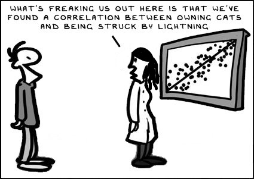

<style type="text/css">
  body{
  font-size: 12pt;
}
</style>

```{r load table making pkgs, include=FALSE}
library(flextable)
library(magrittr)
library(png)

set_flextable_defaults(theme_fun = "theme_zebra", 
                       font.size = 9, fonts_ignore = TRUE)
BorderDk <- officer::fp_border(color = "#B5C3DF", style = "solid", width = 1)
BorderLt <- officer::fp_border(color = "#FFFFFF", style = "solid", width = 1)

palette(c("black", "#003087", "#DAAA00", "#8F92C4", "#E5CF7E", 
          "#001D51", "#B7A99F", "#A51890", "#C5003E", "#FDC596", 
          "#AD5D1E", "gray40", "gray85", "#FFFFFF", "transparent"))

addImg <- function(obj, x = NULL, y = NULL, width = NULL, interpolate = TRUE){
  if(is.null(x) | is.null(y) | is.null(width)){stop("Must provide args 'x', 'y', and 'width'")}
  USR <- par()$usr ; PIN <- par()$pin ; DIM <- dim(obj) ; ARp <- DIM[1]/DIM[2]
  WIDi <- width/(USR[2]-USR[1])*PIN[1] ;   HEIi <- WIDi * ARp 
  HEIu <- HEIi/PIN[2]*(USR[4]-USR[3]) 
  rasterImage(image = obj, xleft = x-(width/2), xright = x+(width/2),
            ybottom = y-(HEIu/2), ytop = y+(HEIu/2), interpolate = interpolate)
}
```

```{r load necessary packages, include=FALSE}
# load packages we need
library(car)        # for various plotting and regression-specific functions
library(viridis)    # colour palettes for improved graph readability
library(Hmisc)      # utility functions
library(RcmdrMisc)  # utility functions
library(corrplot)   # plotting of correlation heatmaps
library(lmtest)     # regression diagnostic tests
library(effects)    # plots and tables for regression models
```

```{r transform variables, include=FALSE}
git <- "https://raw.githubusercontent.com/Ratey-AtUWA/Learn-R/main/"
sv2017 <- read.csv(paste0(git,"sv2017_original.csv"), stringsAsFactors = TRUE)
afs23 <- read.csv(paste0(git,"afs23.csv"), stringsAsFactors = TRUE)
```

```{r banner hide code, fig.height=1.5, fig.width=10, echo=FALSE, out.width="100%", fig.align='right', results='hold'}
logo <- readPNG("UWA logo_text_V_wsL.png")
par(mar = c(0,0,0,0))
layout(matrix(c(1,1,1,1,2),nrow = 1))

plot(c(0,1),c(0,1), axes=F, type="n",xaxt="n", yaxt="n",ann=F)
text(-0.025,0.9, pos = 4, cex = 2.6, font = 2, 
     labels="Data Analysis in R for Environmental Science")
text(-0.025,0.6, pos = 4, cex = 2.2, 
     labels="Statistics for exploring relationships: correlation and regression")
text(-0.025,0.4, pos = 4, font = 3, cex = 1.4, col = 12,
     labels="")
text(1,0.1, pos = 2, font = 3, family = 'serif', cex = 1.5, col = 2,
     labels="Andrew Rate, School of Agriculture and Environment")
plot(1,1, axes=F, type="n",xaxt="n", yaxt="n",ann=F)
addImg(logo, x = 1.2, y = 1, width = 0.5)
par(mar = c(3.5,3.5,0.5,0.5))
```

<p>&nbsp;</p>

<table width="100%" style="background-color: #ffffc0;"><tr><td>
<span style="font-family: 'Century Gothic', 'Source Sans Pro', sans-serif; font-size: 16pt; color: red;">We often set an assessment based on this content. Check the LMS Assignment Hub!</span>
</td></tr></table>

# Correlation & regression 2

# Linear Regression

Regression and correlation are often considered together, but they are not the
same thing. **Correlation** measures the strength and direction of a
relationship between two variables. **Regression** is a model in which the
variance in one variable (the "*dependent*" variable) is explained by one, or a
combination of, *predictor* variables (also called "independent" variables). We 
will cover only **linear regression**, where the dependent variable is a linear
function of the predictor variable(s).

We will first make a **simple linear regression** model predicting chromium from iron.

We first create log-transformed variable columns and inspect the scatterplot 
(Figure \@ref(fig:Cr-Fe-scatterplot)).

```{r Cr-Fe-scatterplot, fig.height=4, fig.width=4, fig.cap="Scatterplot showing relationship between Cr and Fe at Smiths Lake and Charles Veryard Reserves in 2017. Observations and regression lines are separated by sample Type.", results='hold'}
par(mfrow=c(1,1), mar=c(3,3,1,1), mgp=c(1.5,0.5,0), oma=c(0,0,0,0), tcl=0.2,
    cex=1.2, cex.lab=1.1, cex.axis=1., lend="square", ljoin="mitre", font.lab=2)
carPalette(palette())
sv2017$Fe.log <- log10(sv2017$Fe)
sv2017$Cr.log <- log10(sv2017$Cr)
scatterplot(Cr ~ Fe | Type, data = sv2017, 
            log = "xy", smooth = FALSE, pch=c(19,2,3), col = c(4,2,1),
            xlab = "Fe (mg/kg)", ylab = "Cr (mg/kg)", 
            legend = list(coords = "bottomright"))
```

*Check for yourself*: What do the ungrouped scatterplot and regression line look like?

Next use the `lm()` function to create a linear model object (give it a 
sensible name), then summarise it:

```{r simple regression, results='hold'}
lmCrFesimple <- with(sv2017, lm(Cr.log ~ Fe.log))
summary(lmCrFesimple)
```

The output from a linear model summary in R is quite extensive:

1. `Call`: gives the model we specified (for checking)
2. `Residuals`: some summary statistics for the difference of the model from the measured values &ndash; these differences are called the **residuals**
3. `Coefficients`: a table showing the parameters of the line of best fit, shown by the estimates. The *intercept* of the line is in the first row, and the *slope* labelled by the predictor variable. The other columns in the sub-table give the uncertainty in the parameters (Std.Error), and the null hypothesis p-value (`Pr(>|t|)`) based on a t-statistic for each parameter (against H~0~ that there is no effect of a predictor, *i.e*. the slope = 0)
4. `Signif. codes`: just explains the asterisks *** or ** or *
5. The last block of text contains information on how well the model fits the data. We will focus on the R^2^ (R-squared) value, which is equivalent to the proportion of variance in the dependent variable (`Cr.log` in this example) which is explained by the predictor (`Fe.log` in this example). We should also note the overall **p-value**, based on the variance ratio F-statistic, which tests H~0~ = no effect of any predictor.

## Predicting chromium from iron using a regression model which varies by groups 

Note the syntax used to separate by factor categories:

```{r grouped 1predictor regmodel, results='hold'}
lmCrFe_byType <- with(sv2017, lm(Cr.log ~ Fe.log * Type))
summary(lmCrFe_byType)
```

This is similar output to simple linear regression in the previous example, but the `Coefficients:` table is much more complicated.

The first two rows of the `Coefficients:` table under the headings give the intercept and slope for the 'base case', which by default is the first group in the factor separating the groups. In this example the first level of the factor 'Type' is 'sediment' (frustratingly, the output does not show this). <br>
The next rows, starting with the factor name (*i.e*. `TypeSoil` and `TypeStreetDust`), show the *difference* between the **intercepts** for 'Soil' and 'Street dust' groups compared with the base case. <br>
Similarly, the final rows, beginning with the predictor variable name (`Fe.log:TypeSoil` and `Fe.log:TypeStreet dust`), show the *difference* between the **slopes** for 'Soil' and 'Street dust' groups compared with the base case.

## Compare the two models 

Sometimes models can have greater R^2^ but only because we've made them more complex by grouping our observations or by adding more predictors. **We want the simplest model possible**. We compare the models using an analysis of variance with the `anova()` function (where the null hypothesis is equal predictive ability). The models compared need to be **nested**, that is, one is a subset of the other.

```{r ANOVA compare nested models, results='hold'}
anova(lmCrFesimple,lmCrFe_byType)
```

The output here shows us on the basis of an F-test that we can reject H~0~, 
so the more complex model in this case really is better at prediction, since 
p &le; 0.05.

## 'Base **R**' scatter plots representing regression models

```{r scatter-Cr-Fe-pred-obs, fig.width=8, fig.height=4, fig.cap="SCatterplot of Cr vs. Fe in the 2017 Smith's-Veryard data, showing (a) overall relationship and (b) relationship with observations grouped by sample Type.", results='hold'}
par(mfrow=c(1,2), mar=c(3,3,1,1), mgp=c(1.5,0.5,0), oma=c(0,0,0,0), tcl=0.2,
    cex=1.2, cex.lab=1.2, cex.axis=1., lend="square", ljoin="mitre", font.lab=2)
# simple scatterplot
plot(sv2017$Cr~sv2017$Fe, log="xy")
mtext(side=3, line=-1.2, text="(a)", adj=0.05, cex=1.4)
abline(lmCrFesimple, col=8, lty=2)
# grouped scatterplot
plot(sv2017$Cr~sv2017$Fe, log="xy", col=c(1,2,4)[sv2017$Type], pch=c(0,2,16)[sv2017$Type])
mtext(side=3, line=-1.2, text="(b)", adj=0.05, cex=1.4)
# use for() {...} loop to add individual regression lines
for (i in 1:NROW(levels(sv2017$Type))) {
abline(lm(log10(sv2017$Cr)~log10(sv2017$Fe), 
          subset=sv2017$Type==levels(sv2017$Type)[i]), col=2^(i-1), lty=2)
  }
legend("bottomright", legend=levels(sv2017$Type), col=c(1,2,4), pch=c(0,2,16),
       bty="n", inset=0.02)
```

On the basis of Figure \@ref(fig:scatter-Cr-Fe-pred-obs), it seems likely that a
grouped regression model (different slopes and intercepts for each sample Type) 
would better describe the Cr-Fe relationship, as the deviations from the model 
(the *residuals*) would be smaller overall.

<hr style="height: 2px; background-color: #660F00;" />

> "Begin challenging your own assumptions. Your assumptions are your windows on
  the world. Scrub them off every once in awhile, or the light won't come in."
>
> &mdash; [Alan Alda](https://www.imdb.com/name/nm0000257/){target="_blank"}

<hr style="height: 2px; background-color: #660F00;" />

## Requirements and Assumptions of [linear] regression

Ideally, any regression model that we create should fulfil certain assumptions.
There are four main assumptions based on the **residuals** of the regression 
model. The residuals are the differences between the model and reality (*e.g*.
for simple linear regression, the residuals are the the vertical distances
between the line of best fit and the actual points).

<table border=1 width="100%" style="background-color: #fff0c0;"><tr><td>
The assumptions of linear regression are:

1. **Linear relationship**: There is a linear relationship between the independent variable, x, and the dependent variable, y.
2. **Independence**: The residuals are independent. In particular, there is no correlation between consecutive residuals in time series data (*i.e*. no *autocorrelation*).
3. **Homoscedasticity**: The residuals have constant variance at every level of x.
4. **Normality**: The residuals of the model are normally distributed.
</td></tr></table>

We can check these assumptions graphically using *diagnostic plots* (see below), 
or using formal statistical tests, which we do further down.

### Diagnostic plots for Simple linear regression, Cr ~ Fe

```{r diagnostic-plots-simple, fig.width=5, fig.height=5, fig.cap="Regression diagnostic plots for Cr predicted from Fe using a simple linear regression model without grouping", results='hold'}
par(mfrow=c(2,2), mar=c(3,3,2,1))
plot(lmCrFesimple, col=4)
par(mfrow=c(1,1), mar=c(3,3,1,1))
```

### Diagnostic plots for Grouped linear regression, Cr ~ Fe * Type

```{r diagnostic-plots-grouped, fig.width=5, fig.height=5, fig.cap="Regression diagnostic plots for Cr predicted from Fe using a grouped linear regression model with different parameters for each sample Type", results='hold'}
par(mfrow=c(2,2), mar=c(3,3,2,1))
plot(lmCrFe_byType, col=3)
par(mfrow=c(1,1), mar=c(3,3,1,1)) # change back to 1 plot at a time
```

The diagnostic plots (Figures \@ref(fig:diagnostic-plots-simple) and 
\@ref(fig:diagnostic-plots-grouped)) are a visual test of some of the 
assumptions of linear regression models, which relate mainly to the residuals.
<br>
[An alternative from the `car` package is `influenceIndexPlot(yourModelName)`].

The **top left** and **bottom left** plots in Figures
\@ref(fig:diagnostic-plots-simple) and \@ref(fig:diagnostic-plots-grouped) allow
us to assess the assumption of *homoscedasticity*, that is, the residuals should
be of similar absolute magnitude independent of the value of the dependent
variable (actual or predicted). The top left plot also helps us to decide if the
residuals are *independent*. In both the top left and bottom left plots,
residuals should appear randomly distributed with a near-horizontal smoothed
(<span style="color: #0000FF;">blue</span>) line.

The **top right** plot in Figures \@ref(fig:diagnostic-plots-simple) and
\@ref(fig:diagnostic-plots-grouped) is a Q-Q plot which tests another assumption
of regression; that the *residuals should be normally distributed*. The points
should lie along (or close to) the theoretical (dotted) line.

Finally the **bottom left** plot in Figures \@ref(fig:diagnostic-plots-simple) 
and \@ref(fig:diagnostic-plots-grouped) tests whether any observations have an
unusual influence on the regression statistics (the assumption is that they *do
not*).

## Formal statistical tests of regression assumptions

We can test all of the assumptions with formal statistical tests using the 
`car` and `lmtest` **R** packages.

The Breusch-Godfrey test is for residual autocorrelation; H~0~ is that
residuals are not autocorrelated (*i.e*. observations probably *independent*)

```{r bgtest, results='hold'}
require(lmtest)
bgtest(lmCrFe_byType) # autocorrelation (independence)
```

The Breusch-Pagan test is for heteroscedasticity; H~0~ is that residuals are
*homoscedastic* (*i.e*. variance independent of value of variable).

```{r}
bptest(lmCrFe_byType) # homoscedasticity
```

The Rainbow test is to test the assumption of *linearity*; H~0~ is that the
relationship is linear.

```{r}
raintest(lmCrFe_byType) # linearity
```

We can use the Shapiro-WIlk test to check the assumption of *normally distributed 
residuals* (H~0~ is that the residuals *are* normally distributed):

```{r}
shapiro.test(lmCrFe_byType$residuals) # linearity
```

The `outlierTest()` function in the `car` package implements the Bonferroni
outlier test; H~0~ is that all residuals are from the same population (*i.e*. no
outliers). H~0~ is tested with the **Bonferroni** (NOT unadjusted) p-value. If
no Bonferroni p-value is&le;&nbsp;0.05, so we cannot reject H~0~, the function 
outputs the largest residual(s).

```{r paged.print=FALSE}
require(car)
outlierTest(lmCrFe_byType) # influential observations (outliers)
```

### <span style="color: #A020F0; background-color: #fbeeb8;">More things to try (Correlation & regression Week 1)</span>

Try `str(lm_object)` and/or `ls(lm_object)` to see what is stored in regression
results. You might be able to use the contents of a `lm` object to:

  1. plot calculated values (from the regression model) *vs*. measured values 
  2. add a 1:1 relationship to the plot in 1. above
  3. find out if any regression residuals are unusual<br>
     ...and so on.
     
<center></center>

<p>&nbsp;</p>

<hr style="height: 2px; background-color: #5560A4;" />

# Steps in running a multiple regression model

> **NOTE: This section on multiple regression is optional** &ndash; it is more advanced material which we will not cover in class, but which may be useful for analysing data from the class project.

Sometimes the unexplained variation in our dependent variable (*i.e*. the 
residuals) may be able to be explained by one or more additional predictors in
our data. If we suspect this to be true, we can add predictors in a *multiple*
linear regression model.

**Multiple regression models** predict the value of one variable 
(the *dependent variable*) from two or more *predictor variables* 
(or just 'predictors'). They can be very useful in environmental 
science, but there are several steps we need to take to make sure  
that we have a valid model.

In this example we're going to develop a regression model to 
**predict copper (Cu) concentrations** from several predictors. 
It makes sense to choose predictors that represent bulk soil properties 
that could *plausibly* control trace element concentrations. So, 
we choose variables like **pH, EC, organic carbon, cation exchange 
capacity, and some major elements** as predictors 
(<span style="color: #B04030;">**but NOT other trace elements**</span>, 
as their concentrations are probably too low to control the concentration of
anything else!)

Since we don't have organic carbon or cation exchange capacity 
in this dataset, and there are many missing values for EC, our initial 
predictors will be **Al, Ca, Fe, K, Mg, Na, pH, and S**. 
Both the predictors and dependent variable need to be 
**appropriately transformed** before we start!

Also, some of our initial predictors may be highly correlated 
(co-linear) with each other. In multiple regression, we don't want to 
include co-linear predictors, since then we'll have two (or more) 
predictors which effectively contain the same information &ndash; see below.

## Read input data
```{r read input data, paged.print=FALSE}
sv2017 <- read.csv("sv2017_original.csv")
print(sv2017[1:5,2:11], row.names = FALSE)
```

## Assess collinearity between initial set of predictors

First we inspect the correlation matrix. It's useful to include the 
dependent variable as well, just to see which predictors are 
most closely correlated.

(We try to generate a 'tidier' table by restricting numbers to 3 significant 
digits, and making the values = 1 on the diagonal `NA`. We don't need to use
`corTest()` from the  `psych` package, since we're not so interested in P-values
for this purpose.)

Note that all variables are **appropriately transformed**!<br>
*You will need to do this yourself...*

```{r invisibly transform variables, echo=FALSE, results='hide'}
sv2017$Al.pow <- sv2017$Al^powerTransform(sv2017$Al)$lambda
sv2017$Ca.pow <- -1*(sv2017$Ca^powerTransform(sv2017$Ca)$lambda)
sv2017$Fe.pow <- -1*(sv2017$Fe^powerTransform(sv2017$Fe)$lambda)
sv2017$K.log <- log10(sv2017$K)
sv2017$Mg.log <- log10(sv2017$Mg)
sv2017$Na.pow <- -1*(sv2017$Na^powerTransform(sv2017$Na)$lambda)
sv2017$S.pow <- -1*(sv2017$S^powerTransform(sv2017$S)$lambda)
sv2017$Cu.pow <- -1*(sv2017$Cu^powerTransform(sv2017$Cu)$lambda)
```

```{r correlation matrix}
cor0 <- 
  cor(sv2017[,c("Al.pow","Ca.pow","Fe.pow","K.log","Mg.log","Na.pow","pH","S.pow","Cu.pow")],
   use="pairwise.complete")
cor0[which(cor0==1)] <- NA         # change diagonal to NA
print(round(cor0,3), na.print="")  # round to 3 decimal places and print nothing for NAs
rm(cor0)                           # tidy up
```

The rule of thumb we use is that:

>if predictor variables are correlated with Pearson's r &ge; 0.8 or r &le; -0.8, then the collinearity is too large and one of the correlated predictors should be omitted

In the correlation table above this applies to the correlation between
[transformed] Ca and Mg, with **r=0.85**. In this example we will run two
versions of the model, one keeping both Ca and Mg, and one omitting Mg.

<table border=1 width="100%" style="background-color: #fff0c0;"><tr><td>
We have just added a fifth assumption for regression models specifically for 
multiple regression:

5. Independent variables (predictors) should not show significant covariance
</td></tr></table>

<p>&nbsp;</p>

In either case, whether we run the model with or without omitting predictors, 
it's a good idea to calculate *Variance Inflation Factors* on the predictor 
variables in the model (see below) which can tell us if collinearity is a 
problem.

## Generate multiple regression model for Cu (co-linear predictors NOT omitted)

We first delete any observations (rows) with missing (`NA`) values, otherwise
when we change the number of predictors later,  we may not have the same number
of observations for all models, in which case we can't compare them.

```{r lm all variables, results='hold'}
# make new data object containing relevant variables with no missing values
sv2017_multreg <- na.omit(sv2017[c("Cu.pow","pH","Al.pow","Ca.pow","Fe.pow",
                                   "K.log","Mg.log","Na.pow","S.pow")])
# run model using correctly transformed variables
lm_multi <- lm(Cu.pow ~ pH + Al.pow + Ca.pow + Fe.pow + K.log + Mg.log + 
               Na.pow + S.pow, data=sv2017_multreg)
summary(lm_multi)
```

Note that the null hypothesis probability `Pr(>|t|)` for some predictors is
&le;&nbsp;0.05, so we can't reject the null hypothesis &ndash; that this
predictor has no effect on the dependent variable.

## Calculate variance inflation factors (VIF) for the predictors in the 'maximal' model 

To calculate variance inflation factors we use the function `vif()` from the 
`car` package. The input for `vif()` is a `lm` object (in this case `lm_multi`).

```{r VIFs for maximal model, results='hold'}
require(car)
{cat("Variance Inflation Factors\n")
vif(lm_multi)}
```

The VIF could be considered the "penalty" from having 2 or more predictors which
(since they contain the same information) don't decrease the unexplained variance
of the model, but add unnecessary complexity. A general rule of thumb is that if
**VIF > 4** we need to do some further investigation, while serious
multi-collinearity exists **requiring correction if VIF > 10** (Hebbali, 2018).
As we probably expected from the correlation coefficient (above), VIFs for both
Ca and Mg are >4 in this model, which may be OK, but we will try a model which
omits Ca or Mg (we'll choose Mg), since r&nbsp;&ge;&nbsp;0.8 suggests we remove 
one . . .

## Generate multiple regression model for Cu, omitting co-linear predictors

```{r multi lm omitting collinear, results='hold'}
# make new data object containing relevant variables with no missing values
sv2017_multreg <- na.omit(sv2017[c("Cu.pow","pH","Al.pow","Ca.pow","Fe.pow",
                                   "K.log","Mg.log","Na.pow","S.pow")])
row.names(sv2017_multreg) <- NULL  # reset row indices
# run model using correctly transformed variables (omitting co-linear predictors)
lm_multi2 <- lm(Cu.pow ~ pH + Al.pow + Ca.pow + Fe.pow + 
                  K.log + Na.pow + S.pow, data=sv2017_multreg)
summary(lm_multi2)
```

Note that again the null hypothesis probability `Pr(>|t|)` for some predictors 
is >&nbsp;0.05, so we can't reject the null hypothesis &ndash; that this predictor has no 
effect on the dependent variable.

## Calculate variance inflation factors (VIF) for the model omitting co-linear predictors

```{r VIFs for maximal model omitting co-linear predictors, results='hold'}
require(car)
{cat("Variance Inflation Factors\n")
vif(lm_multi2)}
```

**With the co-linear variable(s) omitted (on the basis of |Pearson's r| > 0.8), we now have no VIFs > 4**. So we can move on to stepwise refinement of our [new] 'maximal' model...<br>
[**BUT** note that in this case, with no VIF > 10, we could have simply skipped 
omitting Mg and moved on to the next step below.]

## Stepwise refinement of maximal multiple regression model (omitting co-linear predictors)

We don't want to have too many predictors in our model &ndash; just the
predictors which explain significant proportions of the variance in our
dependent variable. The simplest possible model is best! In addition, our data
may be insufficient to generate a very complex model; one rule-of-thumb suggests
10-20 observations are needed to calculate coefficients for each predictor.
Reimann *et al*. (2008) recommend that the number of observations should be at
least 5 times the number of predictors. So, we use a systematic stepwise
procedure to test variations of the model, which omits unnecessary predictors.

```{r stepwise refinement of multiple regression model}
lm_stepwise <- step(lm_multi2, direction="both", trace=0)
summary(lm_stepwise)
require(car)
{cat("==== Variance Inflation Factors ====\n")
vif(lm_stepwise)}
```
In the optimised model, we find that the stepwise procedure has generated a new
model with fewer predictor variables. You should notice that the p-values
(`Pr(>|t|)`) for intercept and predictors are all now &le;&nbsp;0.05, so we can
reject the null hypothesis for all predictors (*i.e*. none of them have 'no
effect' on Cu). Our VIFs are now all close to 1, meaning negligible collinearity
between predictors.

It's always a good idea to run diagnostic plots (see Figure 
\@ref(fig:diagnostic-plots) below) on a regression model (simple or multiple), 
to check for (i) any systematic trends in residuals, (ii) normally distributed 
residuals (or not), and (iii) any unusually influential observations.

## Regression diagnostic plots

```{r diagnostic-plots, fig.height=6, fig.width=6, fig.cap="Diagnostic plots for the optimal multiple regression model following backward-forward stepwise refinement."}
par(mfrow=c(2,2), mar=c(3.5,3.5,1.5,1.5), mgp=c(1.6,0.5,0), font.lab=2, font.main=3, 
    cex.main=0.8, tcl=-0.2)
plot(lm_stepwise, col=4)
par(mfrow=c(1,1))
```

The optimal model is `Cu.pow ~ Al.pow + Ca.pow + Fe.pow + S.pow`, where suffixes 
`.pow` and `.log` represent power- and log~10~-transformed variables 
respectively. The point labelled `78` does look problematic... 

```{r testing regression assumptions, paged.print=FALSE, results="hold"}
require(lmtest)
require(car)
cat("------- Residual autocorrelation (independence assumption):")
bgtest(lm_stepwise) # Breusch-Godfrey test for autocorrelation (independence)
cat("\n------- Test of homoscedasticity assumption:")
bptest(lm_stepwise) # Breusch-Pagan test for homoscedasticity
cat("\n------- Test of linearity assumption:")
raintest(lm_stepwise) # Rainbow test for linearity
cat("\n------- Bonferroni Outlier test for influential observations:\n\n")
outlierTest(lm_stepwise) # Bonferroni outlier test for influential observations
cat("\n------- Test distribution of residuals:\n")
shapiro.test(lm_stepwise$residuals) # Shapiro-Wilk test for normality
```

## Multiple regression effect plots
```{r effect-plots, fig.height=6, fig.width=6, fig.cap="Effect plots for individual predictors in the optimal multiple regression model following backward-forward stepwise refinement. Light blue shaded areas on plots represent 95% confidence limits."}
require(effects)
plot(allEffects(lm_stepwise, confidence.level=0.95))
```

## Scatterplot of observed *vs*. fitted values

An 'observed *vs*. fitted' plot (Figure \@ref(fig:obs-vs-fitted)) is a way 
around trying to plot a function with multiple predictors (*i.e*. multiple 
dimensions)! We can get the fitted values since these are stored in the `lm` 
object, in our case `lm_stepwise` in an item called `lm_stepwise$fitted.values`.
We also make use of other information stored in the `lm` object, by calling 
`summary(lm_stepwise)$adj.r.squared`.

```{r obs-vs-fitted, fig.height=6, fig.width=6, fig.cap="Measured (observed) vs. predicted values in the optimal multiple regression model."}
par(mar=c(4,4,1,1), mgp=c(2,0.5,0), font.lab=2, cex.lab=1.2, 
    lend="square", ljoin="mitre")
plot(sv2017_multreg$Cu.pow ~ lm_stepwise$fitted.values,
     xlab="Cu.pow predicted from regression model",
     ylab="Cu.pow measured values", pch=3, lwd=2, 
     cex=0.8, col="blue3")
abline(0,1, col="gold4", lty=2, lwd=2)
legend("topleft", legend=c("Observations","1:1 line"), col=c("blue3","gold4"), 
       text.col=c("blue3","gold4"), pch=c(3,NA), lty=c(NA,2), pt.lwd=2, lwd=2, 
       box.col="grey", box.lwd=2, inset=0.02, seg.len=2.7, y.intersp=1.2)
mtext(side=3, line=-5.5, adj=0.05, col="blue3",
      text=paste("Adjusted Rsq =",signif(summary(lm_stepwise)$adj.r.squared,3)))
```

### *What if we remove that outlier?*

```{r multi-lm-omitting-outlier, results='hold'}
# make new data object containing relevant variables with no missing values
sv2017_multreg <- na.omit(sv2017[c("Cu.pow","pH","Al.pow","Ca.pow","Fe.pow",
                                   "K.log","Mg.log","Na.pow","S.pow")])
row.names(sv2017_multreg) <- NULL  # reset row indices
sv2017_multreg <- sv2017_multreg[-78,]
row.names(sv2017_multreg) <- NULL  # reset row indices again
# run model using correctly transformed variables (omitting co-linear predictors)
lm_multi2 <- lm(Cu.pow ~ pH + Al.pow + Ca.pow + Fe.pow + 
                  K.log + Na.pow + S.pow, data=sv2017_multreg)
summary(lm_multi2)
```

Note that again the null hypothesis probability `Pr(>|t|)` for some predictors 
is >&nbsp;0.05, so we can't reject the null hypothesis &ndash; that this predictor has no 
effect on the dependent variable.

#### *Calculate variance inflation factors (VIF) for the model omitting an outlier*

```{r VIFs for maximal model omitting co-linear predictors and outlier, results='hold'}
require(car)
{cat("Variance Inflation Factors\n")
vif(lm_multi2)}
```

**With the co-linear variable(s) omitted (on the basis of |Pearson's r| > 0.8), we now have no VIFs > 4**. So we can move on to stepwise refinement of our [new] 'maximal' model...<br>
[**BUT** note that in this case, with no VIF > 10, we could have simply skipped 
omitting Mg and moved on to the next step below.]

#### *Stepwise refinement of maximal multiple regression model (omitting outlier)*

As before, but without the outlier identified with the Bonferroni `outlierTest()`.

```{r stepwise refinement of multiple regression model no outlier}
lm_stepwise <- step(lm_multi2, direction="both", trace=0)
summary(lm_stepwise)
require(car)
{cat("==== Variance Inflation Factors ====\n")
vif(lm_stepwise)}
```
In the optimised model with an outlier removed in the dataset, we find that the
stepwise procedure has generated a model with fewer predictor variables than
with the outlier present. The p-values (`Pr(>|t|)`) for intercept and predictors
are *mostly* now &le;&nbsp;0.05 (except S.pow, p=0.061), so we can reject the
null hypothesis for most predictors (*i.e*. that they have 'no effect' on Cu).
Our VIFs are still all close to 1, meaning negligible collinearity between
predictors.

Check the diagnostic plots in Figure \@ref(fig:diagnostic-plots) below.

#### *Regression diagnostic plots*

```{r diagnostic-plots-no-outlier, fig.height=6, fig.width=6, fig.cap="Diagnostic plots for the optimal multiple regression model (outlier removed) following backward-forward stepwise refinement."}
par(mfrow=c(2,2), mar=c(3.5,3.5,1.5,1.5), mgp=c(1.6,0.5,0), font.lab=2, font.main=3, 
    cex.main=0.8, tcl=-0.2)
plot(lm_stepwise, col=4)
par(mfrow=c(1,1))
```

The optimal model is `Cu.pow ~ Al.pow + Fe.pow + S.pow`, where suffixes 
`.pow` and `.log` represent power- and log~10~-transformed variables 
respectively. 

```{r testing regression assumptions no outlier, paged.print=FALSE, results="hold"}
require(lmtest)
require(car)
cat("------- Residual autocorrelation (independence assumption):")
bgtest(lm_stepwise) # Breusch-Godfrey test for autocorrelation (independence)
cat("\n------- Test of homoscedasticity assumption:")
bptest(lm_stepwise) # Breusch-Pagan test for homoscedasticity
cat("\n------- Test of linearity assumption:")
raintest(lm_stepwise) # Rainbow test for linearity
cat("\n------- Bonferroni Outlier test for influential observations:\n\n")
outlierTest(lm_stepwise) # Bonferroni outlier test for influential observations
cat("\n------- Test distribution of residuals:\n\n")
shapiro.test(lm_stepwise$residuals) # Shapiro-Wilk test for normality
```

Note that with the outlier removed, the diagnostic tests now show no outlier (no
surprises there, since we removed it!). There is negligible change in the other
diagnostic test results.

## Some brief interpretation

- The adjusted R-squared value of the final model is 0.506 (0.616 with no outlier!), meaning that 50.6% of the variance in Cu is explained by variance in the model's predictors. (The remaining 49.4% of variance must therefore be due to random variations, or 'unknown' variables not included in our model.)
- From the model coefficients and the effect plots we can see that Cu  increases as Ca, Fe, and S increase, but Cu decreases as Al increases. This doesn't necessarily correspond with the individual relationships; Cu **IS** positively correlated with Ca, Fe, and S, **but** actually has no significant relationship with Al (you can check this!).
- Although we can't attribute a causal relationship to correlation or regression relationships, the observed effects in our model **are** consistent with real phenomena. For example, copper is positively related to iron (Fe) in soils at the continental scale; see Hamon *et al*. (2004) and Caritat and Rate (2017). We also know that trace elements are often associated with clays (measured by Al in our data, since clays are aluminosilicate minerals).

# References

Caritat, P. and Rate, A. W. (2017). Detecting anomalous metal concentrations in the regolith using cross-compositional detrending. *Paper presented at the Goldschmidt Conference 2017*, Paris, France. [https://goldschmidtabstracts.info/2017/864.pdf](https://goldschmidtabstracts.info/2017/864.pdf){target="_blank"}.

Cohen, J. 1988. *Statistical Power Analysis for the Behavioral Sciences*, Second Edition. Erlbaum Associates, Hillsdale, NJ, USA.

Hamon, R. E., McLaughlin, M. J., Gilkes, R. J., Rate, A. W., Zarcinas, B., Robertson, A., Cozens, G., Radford, N. and Bettenay, L. (2004). Geochemical indices allow estimation of heavy metal background concentrations in soils. *Global Biogeochemical Cycles*, **18**(GB1014), [http://dx.doi.org/10.1029/2003GB002063](http://dx.doi.org/10.1029/2003GB002063){target="_blank"}. 

Hebbali, A. (2018). Collinearity Diagnostics, Model Fit and Variable Contribution. Vignette for R Package 'olsrr'. Retrieved 2018.04.05, from [https://cran.r-project.org/web/packages/olsrr/vignettes/regression_diagnostics.html](https://cran.r-project.org/web/packages/olsrr/vignettes/regression_diagnostics.html){target="_blank"}.

Reimann, C., Filzmoser, P., Garrett, R.G., Dutter, R., (2008). *Statistical Data Analysis Explained: Applied Environmental Statistics with R*. John Wiley & Sons, Chichester, England (see Chapter 16).
