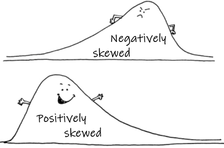

<style type="text/css">
  body{
  font-size: 12pt;
}
</style>

```{r addimg function, include=FALSE}
library(png)
addImg <- function(obj, x = NULL, y = NULL, width = NULL, interpolate = TRUE){
  if(is.null(x) | is.null(y) | is.null(width)){stop("Must provide args 'x', 'y', and 'width'")}
  USR <- par()$usr ; PIN <- par()$pin ; DIM <- dim(obj) ; ARp <- DIM[1]/DIM[2]
  WIDi <- width/(USR[2]-USR[1])*PIN[1] ;   HEIi <- WIDi * ARp 
  HEIu <- HEIi/PIN[2]*(USR[4]-USR[3]) 
  rasterImage(image = obj, xleft = x-(width/2), xright = x+(width/2),
            ybottom = y-(HEIu/2), ytop = y+(HEIu/2), interpolate = interpolate)
}
```

```{r page 1 header hide code, fig.height=1.5, fig.width=10, echo=FALSE, out.width="100%", fig.align='right', results='hold'}
logo <- readPNG("UWA logo_text_V_wsL.png")
par(mar = c(0,0,0,0))
layout(matrix(c(1,1,1,1,2),nrow = 1))

plot(c(0,1),c(0,1), axes=F, type="n",xaxt="n", yaxt="n",ann=F)
text(-0.025,0.9, pos = 4, cex = 2.6, font = 2, col = "#003087", 
     labels="School of Agriculture and Environment")
text(-0.025,0.6, pos = 4, cex = 2.2, col = "#997500", 
     labels="R for data analysis and visualization in Environmental Science")
# text(-0.025,0.4, pos = 4, font = 3, cex = 1.4, col = 12,
#      labels="Geochemical data for international samples of whole rocks (USGS)")
text(-0.025,0.1, pos = 4, font = 3, family = 'serif', cex = 1.5, col = "#636363",
     labels="Andrew Rate, School of Agriculture and Environment, The University of Western Australia")
plot(1,1, axes=F, type="n",xaxt="n", yaxt="n",ann=F)
addImg(logo, x = 1.2, y = 1, width = 0.5)
par(mar = c(3.5,3.5,0.5,0.5))
layout(matrix(c(1),nrow = 1))
```

# Distributions and transformations of variables

## Why transform and/or standardise?

- For graphical representation, to spread the variable(s) over a reasonable 
range so that trends, distributions *etc*. are easier to visualize
- Many classical statistical methods assume *normally distributed variables* 
(ANOVA, correlation, regression)
- To obtain *homoscedastic* variables (homogeneity of variance), another 
assumption of ANOVA and regression
- For multivariate analysis, variables may be measured on different scales, and 
standardisation gives each variable equal weight in the analysis 
(*e.g*., Principal Components Analysis – PCA)

<center>
{width=300 height=300}
</center>

In case you need to read in the data again...

```{r}
hubbard <- read.csv("hubbard.csv", stringsAsFactors = TRUE)
```

## Visualizing distributions

```{r echo=FALSE,results='hide'}
par(mar=c(4,4,2,1), mgp=c(2,0.5,0), tcl=-0.2, font.lab=2, lend=2, ljoin=1)
```

We can use histograms, density plots, or Q-Q plots; probably histograms are 
easiest to interpret.

### Histograms and density plots

Histograms plot the frequency (*i.e*. number) of values of a variable which fall 
into a set of ranges (we use the **R** function `hist()` to draw histograms). The
frequency values are represented as vertical bars, which have width equal to the
range of each 'slice' of the overall range (the slices are usually evenly
spaced). Instead of frequency, *density* can be plotted for each range slice 
using the argument `freq=FALSE` in the `hist()` function; density is essentially 
the relative frequency.

Density plots are a smooth curve of relative frequency *vs*. variable value, and show a 'shape' for the distribution similar to that implied by the histogram. Examples of both the histogram (plotted as density rather than frequency) and an
overplotted density curve are shown in Figure \@ref(fig:hubb-Cd-hist).

```{r hubb-Cd-hist, fig.height=4, fig.width=5, fig.cap="Histogram of Cd (cadmium) concentrations in the Hubbard Brook Experimental Forest, with superimposed density plot. Cd concentrations are log~10~-transformed to address skewness.", message=FALSE, warning=FALSE, echo=-1}
par(mar=c(4,4,2,1), mgp=c(2,0.5,0), tcl=-0.2, font.lab=2, lend=2, ljoin=1)
with(hubbard, hist(log10(Cd), breaks=15, freq=FALSE, col="#e0e0ff", main=""))
lines(density(na.omit(log10(hubbard$Cd))), col="#8080c0", lwd=3)
```

<p>&nbsp;</p>

The histogram for Cd (cadmium) in the Hubbard Brook soil dataset shows a
distribution that **does not** resemble a normal distribution.

**NOTE**: It's worth looking at *log-transformed* histograms since bimodal or 
multi-modal distributions may be easier to see. From the histograms we can see
if (1) the variable is skewed (and therefore probably not normally distributed),
or (2) if the distribution appears to be bimodal or multi-modal.

### Q-Q- plots

A **Q-Q-plot** or normal quantile plot is a plot of all the values in a variable
in ascending order, with the axes transformed in such a way that a perfectly
normally distributed variable would plot on a straight line. Deviations of the
actual points from the theoretical straight line show that where the
distribution of the plotted variable differs from a normal distribution (as in 
the examples in Figure \@ref(fig:hubb-Al-qq) below),

```{r hubb-Al-qq, fig.height=4, fig.width=8, fig.cap="QQ-plots of (left) untransformed and (right) log~10~-transformed Al concentrations in soil the Hubbard Brook Experimental Forest.", message=FALSE, warning=FALSE}
par(mfrow=c(1,2)) # set up graphics parameters to show 2 plots side-by-side
require(car) # the qqPlot() function in car is better than base-R qqplot()
with(hubbard, qqPlot(Al))
with(hubbard, qqPlot(log10(Al))) # not perfect but better than untransformed
```

<p>&nbsp;</p>

Perhaps you noticed output like `[1] 81 94` and `[1] 121  81` above? These are
the row numbers (in the data frame) of observations with the most unusual values
compared with a normal distribution. The same row numbers are also shown on the 
QQ-plots in Figure \@ref(fig:hubb-Al-qq) next to the relevant points.

## Which transformation?

<table cellspacing="2" cellpadding="4" border="2" style="border-collapse: collapse; width: 100%; border-color: #3598DB;">
<tbody>
<tr>
<td style="width: 48%; vertical-align: bottom;">&nbsp;**Nature of variable(s)**</td>
<td style="width: 26%; vertical-align: bottom;">&nbsp;**Transformation**</td>
<td style="width: 26%; vertical-align: bottom;">&nbsp;**R expression**</td>
</tr>
<tr>
<td style="vertical-align: top;">Measurements (lengths, weights, etc.)</td>
<td style="vertical-align: top;">&nbsp;natural log (log~e~)<br />&nbsp;log base 10 (log~10~)<br />&nbsp;Power functions , &nbsp;e.g., x^&minus;&frac12;^</td>
<td style="vertical-align: top;">`log(x)`<br />`log(x,10)` or `log10(x)`<br />`x^-0.5`</td>
</tr>
<tr>
<td colspan="2" style="vertical-align: top; text-align: center;">Use algorithm for Box-Cox transformation to estimate the power function term most likely to<br> result in a normally distributed variable</td>
<td style="vertical-align: top;">`powerTransform(x)`</td>
</tr>
<tr>
<td style="vertical-align: top;">&nbsp;Proportions (*e.g*. percentages)</td>
<td style="vertical-align: top;">&nbsp;Logit</td>
<td style="vertical-align: top;">`log(x/(1-x))`</td>
</tr>
<tr>
<td style="vertical-align: top;">&nbsp;Counts (numbers of individuals)</td>
<td style="vertical-align: top;">&nbsp;square root</td>
<td style="vertical-align: top;">`sqrt(x)`</td>
</tr>
<tr>
<td style="vertical-align: top;">&nbsp;To standardise data (mean = 0, standard deviation = 1)</td>
<td>&nbsp;&mdash;</td>
<td style="vertical-align: top;">`scale(x)`</td>
</tr>
</tbody>
</table>
(`x` is your variable name)

## Power transformation

Sometimes a log transformation will not give our variable(s) a normal
distribution. If so, we can try a *power transformation*. To do this though, we
need to know what power to raise our variable to! There is an algorithm called
'**Box-Cox**' which can estimate the power term. It's the basis of the
`powerTransform()` function in the `car` **R** package.


```{r hubb-OM-hist-x2, fig.height=4, fig.width=9, fig.cap="Histograms of untransformed OM (organic matter) concentrations (left) and power-transformed OM concentrations (right) in Hubbard Brook soil.", message=FALSE, warning=FALSE, echo=-1}
par(mfrow=c(1,2))
powerTransform(hubbard$OM.pct)
hist(hubbard$OM.pct, breaks=15, main = "Untransformed OM (%)")
hist(hubbard$OM.pct^0.0125, breaks=15, main = "Power-transformed OM (%)")
```

<p>&nbsp;</p>

```{r hubb-Al-hist-qq, fig.height=4, fig.width=9, fig.cap="Histogram of power-transformed Al concentrations (left) and QQ-plot of power-transformed Al concentrations (right) in Hubbard Brook soil.", message=FALSE, warning=FALSE,echo=-2}
powerTransform(hubbard$Al)
par(mfrow=c(1,2))
with(hubbard, hist(-1*(Al^-0.1061), main=""))
with(hubbard, qqPlot(-1*(Al^-0.1061), id=FALSE))
```

<p>&nbsp;</p>

**NOTE** that we use a different form of the power transformation equation,
depending on whether the estimated power term is positive or negative If the
power term is negative, we multiply the answer by -1, otherwise the order of
observations is reversed! (lowest becomes highest and vice-versa)

<hr style="height: 2px; background-color: #660F00;" />

> "*But what's normal now anyhow?*"
>
> --- [Porcupine Tree](http://www.darklyrics.com/lyrics/porcupinetree/nilrecurring.html){target="_blank"}, from the song *Normal* (2007)

<hr style="height: 2px; background-color: #660F00;" />

## Tests for normality

**Of course**, these analyses of distributions are only visual. We should also 
run formal statistical tests for normality such as the Shapiro-Wilk test, 
available using the function `shapiro.test()`.

We first **load a new dataset** (we think that the variables in these data illustrate transformations and normality testing a bit better).

```{r read-sv2017, message=FALSE, warning=FALSE}
sv2017 <- read.csv(file="sv2017_original.csv", stringsAsFactors = TRUE)
```

The `sv2017` data are from Smith's Lake and Charles Veryard Reserves in North 
Perth, Western Australia, the field site focus of the class project in the UWA
unit ENVT3361 in 2017 and 2018. We now make much use of these data to illustrate
data analysis with statistics and graphics in **R**.

```{r SLCVR-map, echo=FALSE, fig.width=10.6, fig.height=5.2, fig.cap="(a) map showing locations of Charles Veryard and Smiths Lake Reserves, North Perth, Western Australia; (b) photograph of areas targeted for soil sampling.", results='hold', warning=FALSE, message=FALSE}
library(sf);library(maptiles);library(TeachingDemos)
extent <- st_as_sf(data.frame(x=c(390910,391550),y=c(6466220,6466800)),
                   coords = c("x","y"), crs = st_crs(32750))
SLtiles <- get_tiles(extent, provider = "OpenTopoMap", 
                     zoom=16, crop = TRUE)
par(mfrow=c(1,2), oma=c(3,3,1,1), mgp=c(1.6,0.3,0), tcl=-0.25, lend="square")
plot_tiles(SLtiles)
axis(1);axis(2, at=seq(6466300,6466800,100), labels=seq(6466300,6466800,100))
box()
mtext("Easting (UTM Zone 50, m)", side = 1, line = 1.4, font=2, cex=1.1)
mtext("Northing (UTM Zone 50, m)", side = 2, line = 1.4, font=2, cex=1.1)
shadowtext(c(391355,391260), c(6466430,6466660),
     labels=c("Smith's\nLake\nReserve","Charles Veryard\nReserve"),
     col="darkgreen", bg="white", font=4, cex = 1.2)
mtext("(a)",3,-1.4, adj = 0.01, cex=1.4)
pic1 <- jpeg::readJPEG("SmithsLakeReserve.jpg")
plot(c(0,1),c(0,1), axes=F, type="n",xaxt="n", yaxt="n",ann=F)
addImg(pic1, x = 0.5, y = 0.5, width = 0.95)
mtext(paste("Smith's Lake Reserve, North Perth, Western Australia, with",
            "\ninset showing students sampling soil at Charles Veryard Reserve."), 1, 1)
mtext("(b)",3,-1.6, adj = 0.075, cex=1.4)
```

<p>&nbsp;</p>

We than compare untransformed and transformed versions of a variable (`Ca`) in
this data frame (`sv2017`) using the `shapiro.test()` function:

```{r SW-test-hubb-Ca, message=FALSE, warning=FALSE}
shapiro.test(sv2017$Ca)
shapiro.test(log10(sv2017$Ca))
powerTransform(sv2017$Ca)
shapiro.test(-1*(sv2017$Ca^-0.195))
```

**&#8680; Which transformation makes `sv2017$Ca` normally distributed?**

<table cellpadding="4" border="4" style="border-collapse: collapse; width: 100%; border-color: #FFD700;">
<tr><td style="text-align: center;">
The Null hypothesis H~0~ for the Shapiro-Wilk test is that *the variable's distribution is normal*,<br>so a variable with a normal distribution will have p &gt; 0.05, **not p &le; 0.05**
</td></tr>
</table>

## Many transformations efficiently with R programming

The following code uses a programming loop (`for(...)`) and `if-else` structure  
to semi-automate the process of checking distributions and transforming 
variables.

This version creates new log- and power-transformed variables and tests all 
untransformed and transformed variables for normality, using the Shapiro-Wilk
test.

```{r loop-normality-testing, message=TRUE, warning=FALSE, paged.print=FALSE, results='hold'}
# load required packages
require(car)
# create temp object with names of variables to be transformed
names.of.cols <- names(sv2017)
#
# generate matrix of comma separated values
# and calculate new variables
#
# define starting and ending columns
c1 <- 9
cn <- 36
# make initial output data frame
transf_results <- data.frame("Variable"=seq(c1,cn),
                             "W_orig"=seq(c1,cn),
                             "p_orig"=seq(c1,cn), "W_log_tr"=seq(c1,cn),
                             "p_log_tr"=seq(c1,cn), "W_pow_tr"=seq(c1,cn),
                             "p_pow_tr"=seq(c1,cn), "Pow_term"=seq(c1,cn))
# start loop that assesses variable distributions and creates new variables
for (i in c1:cn) {
  pt1 <- powerTransform(sv2017[, i])
  sv2017[paste0(names.of.cols[i],".log")]<-log10(sv2017[i])
  # if ... else applies factor of -1 to
  # power transforms with negative terms
  # delete next 8 lines if you don't want new columns
  if (as.vector(pt1$lambda) > 0) {
    sv2017[paste0(names.of.cols[i], ".pow")] <-
      sv2017[i] ^ as.numeric(unlist(pt1$lambda))
  } else {
    sv2017[paste0(names.of.cols[i], ".pow")] <-
      -1 * ((sv2017[i]) ^ as.numeric(unlist(pt1$lambda))) }
  # generate and save test statistics
  sw0 <- shapiro.test(sv2017[, i])
  sw1 <- shapiro.test(log10(sv2017[, i]))
  sw2 <- shapiro.test((sv2017[, i]) ^ as.vector(pt1$lambda))
  transf_results[i-(c1-1),] <- c(names.of.cols[i], signif(sw0$statistic, 4),
                        signif(sw0$p.value, 4), signif(sw1$statistic, 4),
                        signif(sw1$p.value, 4), signif(sw2$statistic, 4),
                        signif(sw2$p.value, 4), signif(as.vector(pt1$lambda), 4))
}
#
# output to console (screen)
cat(paste("Table. Shapiro-Wilk statistics (W) and p-values for untransformed",
    "(_orig) and transformed (_log, _pow) variables from soil and sediment",
    "analysis at Smith's Lake Reserve.\n\n)"))
print(transf_results, row.names = FALSE)

##
# export results to a csv file for Excel (if desired)
write.csv(transf_results, file = "transformations.csv", row.names = FALSE)
# remove temporary objects
# to keep R workspace tidy
rm(list=c("names.of.cols","pt1","sw0","sw1","sw2","i"))
# end code
```

* `W_orig` = the Shapiro-Wilk statistic for the untransformed variable
* `p_orig` = probability that H~0~ is true for the untransformed variable
    * *Note that H~0~ for Shapiro-Wilk is that the variable's distribution is normal*,<br>so a variable with a normal distribution will have p &gt; 0.05, 
**not p &le; 0.05**
* `W_log_tr` = the Shapiro-Wilk statistic for the log~10~-transformed variable
* `p_log_tr` = probability that H~0~ is true for the log~10~-transformed variable
* `W_pow_tr` = the Shapiro-Wilk statistic for the power-transformed variable
* `p_pow_tr` = probability that H~0~ is true for the power-transformed variable
* `Pow_term` = the value for power transformation calculated by `powerTransform()`

Once you get this to work, you should verify that it worked! *e.g*. by: 

1. plotting a variable against its transformed version or 
2. comparing histograms or QQ-plots for transformed and untransformed variable 
pairs.

<span style="color: #3f57b8;">[If you just want to check the distributions of variables (transformed or not) 
without generating new columns in your data frame, delete the lines of code from</span> 
`sv2017[paste0(names.of.cols[i],".log")]<-log10(sv2017[i])` <span style="color: #3f57b8;">to</span> 
`-1 * ((sv2017[i]) ^ as.numeric(unlist(pt1$lambda))) }` <span style="color: #3f57b8;">inclusive.]</span>

<hr style="height: 2px; background-color: #660F00;" />



<p>&nbsp;</p>