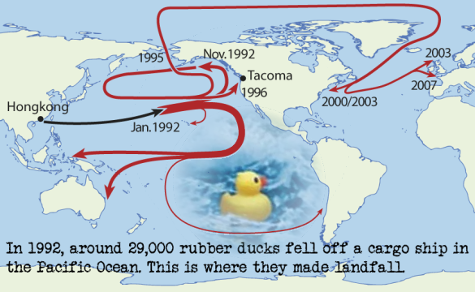

<style type="text/css">
  body{
  font-size: 12pt;
}
</style>

```{r addimg function, include=FALSE}
library(png)
addImg <- function(obj, x = NULL, y = NULL, width = NULL, interpolate = TRUE){
  if(is.null(x) | is.null(y) | is.null(width)){stop("Must provide args 'x', 'y', and 'width'")}
  USR <- par()$usr ; PIN <- par()$pin ; DIM <- dim(obj) ; ARp <- DIM[1]/DIM[2]
  WIDi <- width/(USR[2]-USR[1])*PIN[1] ;   HEIi <- WIDi * ARp 
  HEIu <- HEIi/PIN[2]*(USR[4]-USR[3]) 
  rasterImage(image = obj, xleft = x-(width/2), xright = x+(width/2),
            ybottom = y-(HEIu/2), ytop = y+(HEIu/2), interpolate = interpolate)
}
```

```{r page 1 header hide code, fig.height=1.5, fig.width=10, echo=FALSE, out.width="100%", fig.align='right', results='hold'}
logo <- readPNG("UWA logo_text_V_wsL.png")
par(mar = c(0,0,0,0))
layout(matrix(c(1,1,1,1,2),nrow = 1))

plot(c(0,1),c(0,1), axes=F, type="n",xaxt="n", yaxt="n",ann=F)
text(-0.025,0.9, pos = 4, cex = 2.6, font = 2, col = "#003087", 
     labels="School of Agriculture and Environment")
text(-0.025,0.6, pos = 4, cex = 2.2, col = "#997500", 
     labels="R for data analysis and visualization in Environmental Science")
text(-0.025,0.1, pos = 4, font = 3, family = 'serif', cex = 1.5, col = "#636363",
     labels="Andrew Rate, School of Agriculture and Environment, The University of Western Australia")
text(1.05,0.1,pos=2, font=3, family='mono', cex=1.25, col = "#636363", 
     labels=Sys.Date())
plot(1,1, axes=F, type="n",xaxt="n", yaxt="n",ann=F)
addImg(logo, x = 1.2, y = 1, width = 0.5)
par(mar = c(3.5,3.5,0.5,0.5))
```

# Activities for this Workshop class

<table>
<tr>
<td style="background-color: #c0f0f6;">


There are a few items available as learning materials for this session on **using R + packages to make maps**: two short videos, and two annotated pdfs based on 

1. the R code and 
2. a PowerPoint presentation. 

We suggest going through the first video first, and then trying the code, and finally viewing the second video and trying some different things. The material in the PowerPoint presentation on interpolation of point data is completely optional.

For activities today we suggest:
<ol>
<li>Try to make a map of the Ashfield Flats Reserve area which covers all our sample locations. A good place to start after watching the video/reading the annotated code PDF would be with modifying and running the R code.</li>
</ol>
<p>Good luck!</p>
</td>
</tr>
</table>

<hr style="height: 5px; background-color: #5560A4;" />

## R Mapping - video and text-based learning materials

<table style="width: 100%;" border="0">
<tbody>
<tr>
<td valign="top" style="background-color: #c0f0f6;">
<p><strong>Maps in R: Part 1 &ndash; Basics</strong> 🎬 PLACEHOLDER</p>
</td>
<td valign="top" style="vertical-align: top; background-color: #c0f0f6;">
<p>&darr;The best code for mapping using state-of-the-art <b>R</b> packages is in the code in the rest of this page (below) &darr;</p>
<p><strong>Files to download for this workshop</strong></p>
<table style="width: 100%;" border="0">
<tbody>
<tr>
<td style="width: 50%; background-color: #c0f0f6;"><a href="https://lms.uwa.edu.au/bbcswebdav/pid-3094285-dt-content-rid-40243674_1/xid-40243674_1" target="_blank" rel="noreferrer noopener">Ashfield&nbsp;Flats sediment soil data <strong>2020</strong></a></td>
<td valign="top" style="width: 50%; background-color: #c0f0f6;"><a href="https://lms.uwa.edu.au/bbcswebdav/pid-3094285-dt-content-rid-40243112_1/xid-40243112_1" target="_blank" rel="noreferrer noopener">&nbsp;Code used in video(s)</a></td>
</tr>
<tr>
<td valign="top" style="width: 50%; background-color: #c0f0f6;"><a href="https://lms.uwa.edu.au/bbcswebdav/pid-3094285-dt-content-rid-40243004_1/xid-40243004_1">Ashfield Flats sediment soil data 2019</a></td>
<td style="width: 50%; background-color: #c0f0f6;"><a href="https://lms.uwa.edu.au/bbcswebdav/pid-3094285-dt-content-rid-41529282_1/xid-41529282_1" target="_blank" rel="noopener">Code for adding percentile bubbles to maps (tricky!)</a>&nbsp;<strong>UPDATED 2023</strong></td>
</tr>
<tr style="background-color: #e0e0e0;">
<td valign="top" style="width: 50%; background-color: #c0f0f6;">&nbsp;</td>
<td valign="top" style="width: 50%; background-color: #c0f0f6;">&nbsp;</td>
</tr>
<tr>
<td colspan="2" style="width: 100%; background-color: #c0f0f6;"><strong>Bonus material</strong>
<p><a href="https://raw.githubusercontent.com/Ratey-AtUWA/spatial/main/easy%20peasy%20afr%20map.R" target="_blank" rel="noopener">&nbsp;eezi-peazi Ashfield map (<strong>R</strong> code)</a><br />&nbsp;</p>
<p><a href="https://lms.uwa.edu.au/bbcswebdav/pid-3094285-dt-content-rid-42383985_1/xid-42383985_1" target="_blank" rel="noopener"></a>&nbsp;<a href="https://lms.uwa.edu.au/bbcswebdav/pid-3094285-dt-content-rid-42383985_1/xid-42383985_1" target="_blank" rel="noopener"><strong>R</strong> code to use georeferenced images <em>(e.g</em>. from NearMap) as map backgrounds</a><br />&nbsp;</p>
<p><a href="https://lms.uwa.edu.au/bbcswebdav/pid-3094285-dt-content-rid-42383985_1/xid-42383985_1" target="_blank" rel="noopener"></a>&nbsp;<a href="https://lms.uwa.edu.au/bbcswebdav/pid-3094285-dt-content-rid-42398161_1/xid-42398161_1" target="_blank" rel="noopener">Digitising map features from Google Earth, and R code for a function to convert Google Earth .kml files for use in <strong>R</strong></a></p>
</td>
</tr>
</tbody>
</table>
</td>
</tr>
<tr>
<td valign="top" style="width: 45%; background-color: #c0f0f6;">
<p><strong>Maps in R: Part 2</strong>🎬 PLACEHOLDER</p>
...</td>
<td valign="top" style="width: 50%; background-color: #c0f0f6; vertical-align: top;">
<p><a alt="" href="https://lms.uwa.edu.au/bbcswebdav/pid-3094285-dt-content-rid-41512175_1/xid-41512175_1" target="_blank" rel="noopener">Advanced Spatial Analysis</a><br style="font-family: 'Source Sans Pro'; text-shadow: none; letter-spacing: normal;" />(spatial autocorrelation, variograms, and kriging interpolations)<br />&nbsp;</p>

<p>&nbsp;<a href="https://lms.uwa.edu.au/bbcswebdav/pid-3094285-dt-content-rid-40243094_1/xid-40243094_1" target="_blank">&nbsp;Annotated&nbsp;R code&nbsp;</a> (2022)<br />&nbsp;</p>

<p> <a href="https://lms.uwa.edu.au/bbcswebdav/pid-3094285-dt-content-rid-40243081_1/xid-40243081_1" target="_blank">Annotated&nbsp;PowerPoint&nbsp;slides</a>&nbsp;<br style="font-family: 'Source Sans Pro'; text-shadow: none; letter-spacing: normal;" />(old version, but possibly still useful for some things)</p>
</td>
</tr>
</tbody>
</table>

<p>&nbsp;</p>

# Introduction

This guide shows some of the more common and/or easy ways to make maps in **R**
using map-tile-based backgrounds with data plotted over the base maps. We
introduce *coordinate reference systems*, *recommended packages* which allow
tile-based map drawing, a few ways of *including user data*, and an Appendix on
simple *coordinate conversion*. <br>
The intention is to provide options to plot informative maps, which include the
type of data collected in this class, relatively simply. We *will not* cover
vector-based maps, importing GIS shapefiles, interpolation of point data,
chloropleth maps, and many other map plotting methods.

```{r world map for decoration, fig.align='center', fig.height=2, fig.width=5, message=FALSE, warning=FALSE, out.width='45%', echo=FALSE}
require(ggplot2); require(maps); mp <- NULL
mapWorld <- borders("world", colour="darkseagreen3", fill="darkseagreen3")
ggplot() + mapWorld + 
  xlim(-180,180) + theme_minimal()
```

### load packages needed to make maps

...also read some *data* we need for map annotations, make some *colour*
*palettes* to use later, and set any alternative Windows *fonts*:

```{r load OpenStreetMap invisibly, message=FALSE, warning=FALSE, include=FALSE}
library(OpenStreetMap) 
library(sf)
afs21ll <- read.csv("afs21ll.csv", stringsAsFactors = T)
afs21ll <- st_as_sf(afs21ll, coords=c("Longitude", "Latitude"), 
                    crs=st_crs(4326))
```

```{r load packages and data show code but DO NOT RUN, eval=FALSE, results='hide'}
# library(sp)          # older package for spatial data in R, retiring soon
library(sf)            # Simple Features spatial data in R
library(maptiles)      # get open-source map tiles for background maps
library(prettymapr)    # add scale bar and north arrows to maps
library(viridis)       # colourblind-friendly colour palettes
library(scico)         # more colourblind-friendly colour palettes
library(rosm)          # alternative open-source map tiles for background maps
library(ggmap)         # plotting spatial data with ggplot syntax
library(ggsn)          # add scale and north to ggmap maps (doesn't always work)
# only run next line if you can run it from the console without crashing R!
library(OpenStreetMap) # alternative open-source map tiles for background maps
```

```{r load packages and data invisibly, error=FALSE, warning=FALSE, include=FALSE, results='hide'}
library(sf)
library(maptiles)
library(prettymapr)
library(viridis)
library(rosm)
library(ggmap)
library(ggsn)
# un-comment next line if you can run it from the console without crashing R!
# library(OpenStreetMap) 
```

```{r load maps data and do setups, error=FALSE, message=FALSE, warning=FALSE, results='hold'}
git <- "https://raw.githubusercontent.com/Ratey-AtUWA/"
afr_map <- read.csv(file=paste0(git,"spatial/main/afr_map_v2.csv"), 
                      stringsAsFactors = TRUE)
places <- read.csv(file=paste0(git,"Learn-R/main/places.csv"),
                   stringsAsFactors = TRUE)
taita <- data.frame(lon = c(174.967,174.9549,174.9489,174.9521), 
                    lat = c(-41.1761,-41.1812,-41.1831,-41.1838), 
                    name = c("Tait\u0101 College", "Tait\u0101 School",
                          "Fraser Park","Home")) # we need this later...
taita$name <- as.factor(taita$name) # ...and this
pal4lite <- c("black", viridis::plasma(8), "white")
pal4liteTransp <- c("black", scico::scico(8, alpha = 0.8, palette = "hawaii"),"white")
pal4dark <- c("white", scico::scico(8, begin=0.3, palette="hawaii"), "black")
windowsFonts(nar=windowsFont("Arial Narrow"), monosans=windowsFont("Consolas"))
```

## Preparing to make maps

First we read the data we need: from `.csv` files on a website, into an **R**
data frame:

```{r read AFR data, warning=FALSE, error=FALSE, results='hold',eval=-1}
# afs19 <- read.table('clipboard', header=T, sep="\t", stringsAsFactors = TRUE)
# alternative code reading data from a file:
afs19 <- read.csv(file=paste0(git,"Learn-R/main/afs19.csv"), 
                  stringsAsFactors = TRUE) # use this one
afs22 <- read.csv(file=paste0(git,"Learn-R/main/afs22S1.csv"), 
                  stringsAsFactors = TRUE)
```

<hr style="height: 2px; background-color: #660F00;" />

> "*I wisely started with a map*."
>
> --- [J. R. R. Tolkien](https://www.tolkienestate.com/painting/maps/){target="_blank"}

<hr style="height: 2px; background-color: #660F00;" />

<table border=1><tr><td style="background-color: #FFF0E0;">
**Notes about maps**

[distilled from the author instructions of a few relevant journals] 

- Include a <span style="color:red;">**scale**</span>, and <span style="color:red;">**north arrow**</span> (and where relevant, <span style="color:red;">**co-ordinates**</span> of latitude (°N, °S) and longitude (°W, °E);<br /><span style="color: #6000B0;">grid-based systems such as UTM are also ok, and can allow scale to be omitted if grid measurements are in metres).</span>
- The use of colour unnecessarily is discouraged. 
- All text must be large enough to be readable. Avoid making the lettering too large for the figure &ndash; this can result in a "cartoonish" appearance.  
- Use a clear, sans serif typeface &ndash; the **R** default is <span style="color:red; font-family:Arial;">Arial</span> (<span style="color:red; font-family:Helvetica;">Helvetica, </span><span style="color:red; font-family:'Segoe UI';">Segoe UI, </span><span style="color:red; font-family:'Source Sans Pro';">Source Sans Pro, </span><span style="color:red; font-family:ubuntu;">Ubuntu, *etc*. are all OK</span>).  
- Try to keep all text in a figure (including axis labels, contour labels, latitude and longitude, scale text, inset text, *etc.*) around the same size to aid reducibility and/or enlargement.
- Use a white background behind lettering that crosses a dark or textured area in a figure.
- Maps must show locations of any significant places/sample points, *etc*., mentioned in your report's text or tables. These might include cities, rivers, lakes, ponds, drains, landmarks, presumed sources of contamination, and so on. (These features are not always present on map tiles.)
- A country map is required for all studies, locating the study area. Adjacent countries must be located and named. [*Optional for this class*].
</td></tr></table>

<p>&nbsp;</p>

Before we start downloading map data, we define and save some commonly-used
coordinate reference systems which describe the map projection of our GPS data.
The function `st_crs()` is from the `sf` package (see explanation below), and
as the argument for the `st_crs()` function we use the EPSG code for the desired
projection. See [https://epsg.io](https://epsg.io){target="_blank"} for more
information.

```{r define CRS, warning=FALSE, error=FALSE, results='hold'}
LongLat <- st_crs(4326) # uses Earth ellipsis specs from WGS84 datum
UTM50S <- st_crs(32750) # just for Zone 50, S hemisphere!
```

We will use these coordinate reference system objects later. For now
we're going to work in UTM coordinates.

Next we'll convert our data frames to *Simple Features* spatial data, using the 
**R** package `sf` (Pebesma, 2018). Simple Features is a formal standard 
(ISO 19125-1:2004) that describes how objects in the real world can be 
represented in computers - see
<https://r-spatial.github.io/sf/articles/sf1.html>.

We also make equivalents of these two sf-dataframes in the longitude--latitiude
coordinate system, using the `st_transform` function.

```{r}
afs19utm <- st_as_sf(afs19[-9,], # omitting row 9 where coordinates are missing
                     coords = c("Easting","Northing"),
                     crs = UTM50S)
afs22utm <- st_as_sf(afs22, coords = c("Easting","Northing"),
                     crs = UTM50S)
afs19ll <- st_transform(afs19utm, crs = LongLat)
afs22ll <- st_transform(afs22utm, crs = LongLat)
```

<hr style="height: 2px; background-color: #5560A4;" />

## Alternative 1 -- Maps in R using the maptiles package

### Defining the mapped area

We define the area we need for our map and save it in a simple features object called `extent`.

An easy way to get bounding coordinates (in longitude, latitude) is by using
Google Maps or Google Earth. Google Earth allows the option to set the
coordinate system to UTM. If we generate latitude--longitude coordinates, we
would need to convert our *Simple Features* object (see the **Appendix**).
If our input coordinates are Longitude--Latitude, note that south latitudes (and
west longitudes) are negative, and we want decimal degrees rather than
degrees-minutes-seconds. Also note that coordinates from Google Maps and Google
Earth (except in saved [.kml]{style="font-family: monospace;"} files) are in the
order (Latitude, Longitude); *i.e*. $(y,x)$, whereas $(x,y)$ (Longitude,
Latitude) seems to make more sense.

For coordinates in the `sf` and `maptiles` packages, $x$ coordinates are
commonly Eastings or Longitudes, and $y$ coordinates are commonly Northings or
Latitudes.

```{r make map extent object, warning=FALSE, error=FALSE, results='hold'}
extent <- st_as_sf(data.frame(x=c(399800,400700),y=c(6467900,6468400)),
                   coords = c("x","y"), crs = UTM50S)
```

**NOTE**: The projection we specify here will be the one the map plots in!

### Getting the map tile data

We now need some functions from the `maptiles` package (Giraud 2021).
We're using one of the OpenStreetMap tile options, but the following
tile providers also work: <br>
`OpenStreetMap, OpenStreetMap.HOT, Esri.WorldStreetMap, Esri.WorldTopoMap, Esri.WorldImagery, Esri.WorldGrayCanvas`,
`Stamen.Toner, Stamen.TonerBackground, Stamen.TonerHybrid, Stamen.TonerLines, Stamen.TonerLabels, Stamen.TonerLite`,
`CartoDB.Positron, CartoDB.DarkMatter, CartoDB.Voyager` (all CartoDB... tiles 
have variants which work), and `OpenTopoMap` <br>
The option `crop = TRUE` is included to crop the tiles to our defined area
in the `extent` object. If we leave it out, the map may change
shape as it will use only square (uncropped) map tiles.

```{r get_tiles, warning=FALSE, error=FALSE, results='hold'}
# NOTE: projection of input object e.g. 'extent' sets map projection
aftiles <- get_tiles(extent, provider = "OpenStreetMap.HOT", crop = TRUE)
```

### Plotting the map

The `aftiles` object we created is a `SpatRaster` object which needs the
maptiles package loaded to be able to plot it. We need to set the outer
margins of the plot area (by default they are zeros) to allow plotting
of axes *etc* -- see Figure \@ref(fig:plot-map1-axes).

```{r plot-map1-axes, fig.align='center', fig.cap="Map of Ashfield Flats in the UTM projection, generated using the maptiles R package, with OpenStreetMap tiles.", fig.height=4.35, fig.width=6.8, message=FALSE, warning=FALSE, out.width='70%', results='hold'}
par(oma=c(3,3,1,1), lend="square")
plot_tiles(aftiles)

box(lwd=6,col="white") # tidies up skewness of UTM tiles a bit
axis(1, tcl=-0.2, mgp = c(1.6,0.3,0))
mtext("Easting (UTM Zone 50, m)", side = 1, line = 1.5, font=2)
axis(2, tcl=-0.2, mgp = c(1.6,0.3,0))
mtext("Northing (UTM Zone 50, m)", side = 2, line = 1.5, font=2)
box()
```

The next chunk of code adds the `prettymapr` features shown in Figure 2. In this
code, `plotepsg = 32750` refers to the EPSG code for the UTM projection in Zone
50 (EPSG 32750), which we need to include so that the scale bar shows the
correct distances. (Long-Lat is EPSG 4326 in WGS84)

**NOTE**: If the `addscalebar` function does not work, run this line of code:
```{r load-modified-addscalebar-function, eval=FALSE}
source("https://github.com/Ratey-AtUWA/Learn-R/raw/main/scalebar_use_sf_prettymapr.R")
```
(This will replace the function in the `prettymapr` package with a modified 
version that uses the `sf` package for coordinate conversions instead of `sp` and `rgdal`.)

```{r map-north-scale-pretend, eval=FALSE, message=FALSE, warning=FALSE}
# . . . continuing previous code . . .
addnortharrow(text.col=1, border=1)
addscalebar(plotepsg = 32750, label.col = 1, linecol = 1, 
            label.cex = 1.2, htin=0.15, widthhint = 0.15)
```

```{r map-north-scale, fig.align='center', fig.cap="Map of Ashfield Flats (UTM), with added North arrow and scale bar from prettymapr, over OpenStreetMap tiles acquired using maptiles.", fig.height=4.35, fig.width=6.8, message=FALSE, warning=FALSE, out.width='70%', results='hold',echo=FALSE}
par(oma=c(3,3,1,1), lend="square");plot_tiles(aftiles);box(lwd=6,col="white");axis(1, tcl=-0.2, mgp = c(1.6,0.3,0));mtext("Easting (UTM Zone 50, m)", side = 1, line = 1.5, font=2);axis(2, tcl=-0.2, mgp = c(1.6,0.3,0));mtext("Northing (UTM Zone 50, m)", side = 2, line = 1.5, font=2);box()

addnortharrow(text.col=1, border=1)
addscalebar(plotepsg = 32750, label.col = 1, linecol = 1, 
            label.cex = 1.2, htin=0.15, widthhint = 0.15)
```

### Adding our data and map annotations

Very often we would like to **add our own information to a map**, such
as the location of samples, often with different sizes, shapes, or
colours of symbols to represent numerical information.

Since we have a map in UTM coordinates, we can now add plots of our data
based on UTM locations (with a legend, of course -- see Figure 
\@ref(fig:add-data)). We can plot the points from the non-spatial data frame
`afs19`, but here we `plot` the points from `afs19utm`, with the `add=TRUE`
option. We add a legend to the plot in the usual way.

```{r add-data-pretend, eval=FALSE, message=FALSE, warning=FALSE}
# . . . continuing from previous code . . .
clrz <- plasma(15)[6:15]   # plasma is one of the viridis:: palettes
with(afs19utm, plot(geometry, add=TRUE,  
                    pch = rep(21:25,2)[Group], 
                    bg = clrz[Group]))
legend("bottomright", legend=levels(as.factor(afs19$Group)),
       pch = rep(21:25,2), pt.bg = clrz,
       title = "Group", inset = 0.02, ncol = 2)
```

```{r add-data, eval=TRUE, message=FALSE, warning=FALSE, out.width='70%',echo=FALSE, fig.height=4.35, fig.width=6.8, fig.cap = "Map of Ashfield Flats (UTM), with added North arrow, scale bar, and user data, over OpenStreetMap tiles acquired using maptiles.", fig.align='center', results='hold'}
par(oma=c(3,3,1,1), lend="square");plot_tiles(aftiles);box(lwd=6,col="white");axis(1, tcl=-0.2, mgp = c(1.6,0.3,0));mtext("Easting (UTM Zone 50, m)", side = 1, line = 1.5, font=2);axis(2, tcl=-0.2, mgp = c(1.6,0.3,0));mtext("Northing (UTM Zone 50, m)", side = 2, line = 1.5, font=2);box();addnortharrow(text.col=1, border=1);addscalebar(plotepsg = 32750, label.col = 1, linecol = 1, label.cex = 1.2, htin=0.15, widthhint = 0.15)
clrz <- plasma(15)[6:15]
with(afs19utm, plot(geometry, add=TRUE,  
                    pch = rep(21:25,2)[Group], 
                    bg = clrz[Group]))
legend("bottomright", legend=levels(as.factor(afs19$Group)),
       pch = rep(21:25,2), pt.bg = clrz,
       title = "Group", inset = 0.02, ncol = 2)
```

We can also add digitized map features such as wetland ponds, drains,
*etc*., if these are not on the map tiles already. Ideally we would add
these **before** plotting the data, to avoid the type of overplotting
shown in Figure \@ref(fig:map-annot).

```{r annot-pretend, eval=FALSE, error=FALSE, warning=FALSE}
# . . . continuing from previous code . . .
with(afr_map, lines(drain_E, drain_N, col = "cadetblue", lwd = 2))
with(afr_map, lines(wetland_E, wetland_N, col = "cadetblue", lwd = 1, lty = 2))
```

```{r map-annot, error=FALSE, warning=FALSE, echo=FALSE, fig.height=4.35, fig.width=6.8, fig.align='center', fig.cap="Map of Ashfield Flats (UTM), with added North arrow, scale bar, user data, and additional map items, over OpenStreetMap tiles acquired using maptiles.", results='hold'}
# everything we did above in the first line
par(oma=c(3,3,1,1), lend="square");plot_tiles(aftiles);box(lwd=6,col="white");axis(1, tcl=-0.2, mgp = c(1.6,0.3,0));mtext("Easting (UTM Zone 50, m)", side = 1, line = 1.5, font=2);axis(2, tcl=-0.2, mgp = c(1.6,0.3,0));mtext("Northing (UTM Zone 50, m)", side = 2, line = 1.5, font=2);box();addnortharrow(text.col=1, border=1);addscalebar(plotepsg = 32750, label.col = 1, linecol = 1, label.cex = 1.2, htin=0.15, widthhint = 0.15); with(afs19utm, plot(geometry, add=TRUE, pch = rep(21:25,2)[Group], bg = clrz[Group]))
legend("bottomright", legend=levels(as.factor(afs19$Group)), pch = rep(21:25,2), pt.bg = clrz, title = "Group", inset = 0.02, ncol = 2)
with(afr_map, lines(drain_E, drain_N, col = "cadetblue", lwd = 2))
with(afr_map, lines(wetland_E, wetland_N, col = "cadetblue", 
                    lwd = 1, lty = 1))
```

Finally, we would most likely want to add some text. Text labels should
also be added *before* plotting the data. The final map is shown in
Figure \@ref(fig:map-text-labels).

```{r map-text-labels-pretend, error=FALSE, warning=FALSE, eval=FALSE}
# . . . continuing from previous code . . .
text(c(400263, 399962, 400047), c(6468174, 6468083, 6468237),
     labels = c("Chapman Drain","Kitchener Drain", "Woolcock Drain"),
     pos = c(2,2,4), cex = 0.8, font = 3, col = "cadetblue")
```

```{r map-text-labels, error=FALSE, warning=FALSE, echo=FALSE, fig.height=4.35, fig.width=6.8, fig.align='center', fig.cap="Map of Ashfield Flats (UTM), with added North arrow, scale bar, user data, and additional map items plus text labels, over OpenStreetMap tiles acquired using maptiles.", results='hold'}
# everything we did above in the first line
par(oma=c(3,3,1,1), lend="square");plot_tiles(aftiles);box(lwd=6,col="white");axis(1, tcl=-0.2, mgp = c(1.6,0.3,0));mtext("Easting (UTM Zone 50, m)", side = 1, line = 1.5, font=2);axis(2, tcl=-0.2, mgp = c(1.6,0.3,0));mtext("Northing (UTM Zone 50, m)", side = 2, line = 1.5, font=2);box();addnortharrow(text.col=1, border=1);addscalebar(plotepsg = 32750, label.col = 1, linecol = 1, label.cex = 1.2, htin=0.15, widthhint = 0.15); with(afs19utm, plot(geometry, add=TRUE, pch = rep(21:25,2)[Group], bg = clrz[Group]))
legend("bottomright", legend=levels(as.factor(afs19$Group)), pch = rep(21:25,2), pt.bg = clrz, title = "Group", inset = 0.02, ncol = 2); with(afr_map, lines(drain_E, drain_N, col = "cadetblue", lwd = 2)); with(afr_map, lines(wetland_E, wetland_N, col = "cadetblue", lwd = 1, lty = 2))
text(c(400263, 399962, 400047), c(6468174, 6468083, 6468237),
     labels = c("Chapman Drain","Kitchener Drain", "Woolcock Drain"),
     pos = c(2,2,4), cex = 0.8, font = 3, col = "cadetblue")
```

### Making a bubble map

We use essentially the same code as for the maps above (except plotting the
annotations and data in the correct order!). Then we use the `symbols()`
function to make the 'bubbles', making sure that we include the options 
`add = TRUE` so we overplot the map, and `inches = FALSE` so we can manually
scale the bubbles. The factor of `0.4` used to scale the circles in the code for
bubbles and legend is *found by trial-and-error* (it *is* possible to write a
simple algorithm to estimate a scaling factor from the data). A map like that
shown in Figure \@ref(fig:map-bubbles) is a good exploratory data analysis tool,
as even without the legend it shows any unevenness in concentrations, including
where high concentrations are located.

```{r map-bubbles, fig.align='center', fig.cap="\\label{bubbles}Bubble map of zinc concentrations in sediment and soil at Ashfield Flats in 2019, over OpenStreetMap tiles acquired using maptiles.", fig.height=4.35, fig.width=6.8, message=FALSE, warning=FALSE, out.width='70%', results='hold'}
par(oma=c(3,3,1,1), lend="square")
plot_tiles(aftiles)
box(lwd=6,col="white") # tidies up skewness of UTM tiles a bit
axis(1, tcl=-0.2, mgp = c(1.6,0.3,0))
mtext("Easting (UTM Zone 50, m)", side = 1, line = 1.5, font=2)
axis(2, tcl=-0.2, mgp = c(1.6,0.3,0))
mtext("Northing (UTM Zone 50, m)", side = 2, line = 1.5, font=2)
box()
with(afr_map, lines(drain_E, drain_N, col = "cadetblue3", lwd = 2))
with(afr_map, lines(wetland_E, wetland_N, col = "cadetblue3", lwd = 1, lty = 2))
text(c(400263, 399962, 400047), c(6468174, 6468083, 6468237),
     labels = c("Chapman Drain","Kitchener Drain", "Woolcock Drain"),
     pos = c(2,2,4), cex = 0.8, font = 3, col = "cadetblue")
addnortharrow(text.col=1, border=1)
addscalebar(plotepsg = 32750, label.col = 1, linecol = 1, 
            label.cex = 1.2, htin=0.15, widthhint = 0.15)
# plot bubbles using the symbols() function
with(afs19, symbols(Easting, Northing, add = TRUE, circles = 0.4*sqrt(Zn),
                    inches = FALSE, fg = "purple", bg = "#8000FF40"))
# manual legend
if (pretty(afs19$Zn)[1] < 0.001) {
  bublo <- pretty(afs19$Zn)[2]/2
} else {
  bublo <- pretty(afs19$Zn)[1]
}
bubhi <- pretty(afs19$Zn)[NROW(pretty(afs19$Zn))]
symbols(c(400600,400600),c(6468040,6467980), circles=0.4*sqrt(c(bublo,bubhi)), add=T,
        lwd=1, inches=F, fg = "purple", bg = "#8000FF40")
text(c(400600,400620,400620),c(6468100,6468040,6467980), 
     labels=c("Zn (mg/kg)",bublo,bubhi), cex=0.85, pos = c(1,4,4))
```

### Categorized (*e.g*. percentile) bubble map

We make a new column in our data frame by cutting the measurement of
interest, in this example **Zn**, into percentiles. The new column called `QZn`
is a factor which identifies which percentile of Zn concentration each sample is
in. We then use this factor to define symbols, sizes, and colours for each
sample location. We add a line break to text labels using $\backslash$`n`.

```{r PctBubb, fig.align='center', fig.cap="Map showing percentile ranges of zinc concentrations in sediment and soil at Ashfield Flats in 2019, over OpenStreetMap tiles acquired using maptiles.", out.width='70%', fig.height=6.4, fig.width=10, message=FALSE, warning=FALSE, results='hold'}
par(oma=c(3,3,1,1), lend="square")
plot_tiles(aftiles)
box(lwd=6,col="white") # tidies up skewness of UTM tiles a bit
axis(1, tcl=-0.2, mgp = c(1.6,0.3,0))
mtext("Easting (UTM Zone 50, m)", side = 1, line = 1.5, font=2)
axis(2, tcl=-0.2, mgp = c(1.6,0.3,0))
mtext("Northing (UTM Zone 50, m)", side = 2, line = 1.5, font=2)
box()
with(afr_map, lines(drain_E, drain_N, col = "cadetblue3", lwd = 2))
with(afr_map, polygon(wetland_E, wetland_N, col = "cadetblue2", 
                      border = "cadetblue3"))
text(c(400263, 399962, 400047), c(6468174, 6468083, 6468237),
     labels = c("Chapman\nDrain","Kitchener\nDrain", "Woolcock\nDrain"),
     pos = c(2,2,4), cex = 0.8, font = 3, col = "cadetblue")
addnortharrow(text.col=1, border=1)
addscalebar(plotepsg = 32750, label.col = 1, linecol = 1, 
            label.cex = 1.2, htin=0.15, widthhint = 0.15)
# percentile plot
afs19$QZn <- cut(afs19$Zn, quantile(afs19$Zn, 
                 p=c(0,0.02,0.05,0.25,0.5,0.75,0.95,0.98,1), 
                 na.rm=T), labels=c("Q0-02","Q02-05","Q05-25","Q25-50",
                                    "Q50-75","Q75-95","Q95-98","Q98-max"))
palette(pal4liteTransp) # use colours with semi-transparency (defined near top)
# use percentile factor column to categorize points
with(afs19, 
     points(Easting, Northing, 
            pch = c(22,22,22,3,4,21,21,21)[QZn], 
            col = c(1,1,1,4,5,1,1,1)[QZn], bg = c(9:2)[QZn],
            lwd = c(1,1,1,2,2,1,1)[QZn], 
            cex = c(0.5,0.65,0.8,1,1,1.5,2.2,3)[QZn])
     )
legend("bottomright", legend = levels(afs19$QZn), title="Zn",
       pch = c(22,22,22,3,4,21,21,21), col = c(1,1,1,4,5,1,1,1),
       pt.lwd = c(1,1,1,2,2,1,1), pt.bg = c(9:2 ), 
       pt.cex = c(0.5,0.65,0.8,1,1,1.5,2.2,3),
       bty = "n", inset = 0.02, cex = 0.85, y.intersp = 1.2)
palette(pal4lite) # change back to non-transparent palette (optional)
afs19$QZn <- NULL # to delete quantile column (optional; you can leave it in)
```

The resulting percentile bubble map (Figure \@ref(fig:PctBubb)) adds value to
the 'standard' bubble map (Figure \@ref(fig:map-bubbles)), as it adds some statistical meaning to the bubble sizes.
A similar map could be created by using the Tukey boxplot thresholds instead of
percentiles which could show potential outliers (*i.e*. using the
`boxplot.stats()` function to generate categories instead of the `quantile()`
function.)

<p>&nbsp;</p>

<table border=1><tr><td style="background-color: #FFFF80;">
<span style="font-size: 14pt;">**Warning**: semi-transparent colours 
(*i.e*. alpha < 1) are not supported by metafiles in R. To use semi-transparent 
colours, save as `.png` or `.tiff`, or copy as a bitmap.</span>
</td></tr></table>

<hr style="height: 2px; background-color: #5560A4;" />

## Alternative 2 -- Maps in R using the ggmap package

The [ggmap]{style="font-family: monospace; background-color: #e8e8e8;"} package 
(Kahle and Wickham 2013) is an extension of
[ggplot]{style="font-family: monospace; background-color: #e8e8e8;"}, 
so it's easier to use if you are familiar with 
[ggplot]{style="font-family: monospace; background-color: #e8e8e8;"}
and the associated family of packages. [*You will need a Google maps API key which you can get by registering at [https://developers.google.com/maps](https://developers.google.com/maps){target="_blank"}*]{style="color: #A00000;"}

```{r get-api-key, include=FALSE}
secret <- read.csv("gmapskey.csv")
```

First we make a [ggmap]{style="font-family: monospace; background-color: #e8e8e8;"} 
object, locating the map by its central coordinate with the extent controlled by
the [zoom]{style="font-family: monospace; background-color: #e8e8e8;"} option:

```{r make ggmap object, message=FALSE, warning=FALSE, eval=-1, results='hold', echo=-4}
library(ggmap)
register_google(key = secret[1,1]) # you would replace secret[1,1] with your API key
udubua.gg <- get_googlemap(center=c(115.8213,-31.98165), 
                           zoom = 16, maptype = "terrain", color = "bw")
rm(secret)
```

Next we plot the ggmap object using ggplot grammar. It's possible to just plot
the object (*i.e*. run `ggmap(udubua.gg)`), but it's good to have more control
over plot options **and** to plot some data over the base map. In the example in
Figure \@ref(fig:ggmap1), we use the aesthetic in `geom_point()` to plot
different categories with different shapes and colours, with the categories
defined by the factor `Type`. A range of map styles is available by selecting a
combination of one of `maptype = "terrain", "satellite", "roadmap"`, or
`"hybrid"`, together with `color = "color"` or `"bw"`. **Note**: the `ggsm`
package is designed to add scale bar and north arrow to ggmaps, but it seems
buggy and we currently don't recommend it - the north arrow seems OK though.

```{r ggmap1, fig.height=4.5, fig.width=6, fig.align='center', fig.cap="Map of the University of Western Australia campus at Crawley, showing the location of libraries and cafés, plotted over Google maps tiles acquired using the R package ggmap.", out.width='75%', message=FALSE, warning=FALSE, results='hold'}
ggmap(udubua.gg) + 
  labs(y="Latitude (\u00B0S)", x = "Longitude (\u00B0E)") + 
  geom_text(aes(x = 115.825, y = -31.98, label = "Swan\nRiver",
                fontface = "italic", family="sans"), 
            size = 4, vjust = 0, hjust = 0, color="gray40") + 
  geom_point(aes(x = Longitude, y = Latitude, col=Type, shape=Type), 
             data = places, size=3) +
  theme(axis.text=element_text(size=9, color="black"),
        axis.title=element_text(size=11,face="bold"))
```

There are numerous possibilities with `ggmap` and the features made possible by
`ggplot2` that are not illustrated by Figure \@ref(fig:ggmap1). For example, we
could use `size` as an aesthetic (*i.e*. include within `aes(...)` with `size =
variableName`), to generate something like a bubble map. Although there is an
option to set the map size (and therefore aspect ratio) in the `get_googlemap()`
function, we have found that this doesn't work consistently, so we recommend
leaving the map dimensions and aspect ratio at their default values.

### Other map types using ggmap

Another option currently implemented in `ggmap` are some of the *Stamen* map
tiles, accessible with the `get_stamenmap()` function.

- The Stamen "terrain" tiles seem to be available up to `zoom = 13`, and are good for showing maps at the scale of 1-2 suburbs or a small town (Figure \@ref(fig:ggStamenNZ)), with 'hill shading' to show terrain.
- The Stamen toner variants are minimalist maps which are good at de-emphasizing 
the base map background to emphasise added data (see the example in Figure
\@ref(fig:ggStamenAF)).
- The Stamen "watercolor" tiles are also available.

```{r ggStamenNZ, fig.height=6.8, fig.width=10, fig.align='center', fig.cap="Map of the central Hutt Valley, New Zealand, plotted with Stamen terrain map tiles acquired using the R package ggmap.", out.width='80%', message=FALSE, warning=FALSE, results='hold'}
tai_Stamen <- get_stamenmap(bbox=c(left=174.9, bottom = -41.2,
                                   right = 175.0, top = -41.15),
                            zoom=13, # seems to be max zoom
                            maptype = "toner-lite", color = "color")
ggmap(tai_Stamen) + 
  labs(y="Latitude (\u00B0S)", x = "Longitude (\u00B0E)") + 
  geom_rect(aes(xmin=174.94, xmax=174.96, ymin=-41.178,ymax=-41.188),
               colour="red3", fill=NA, size=1.2) +
  geom_text(aes(x = 174.961, y = -41.183, label = "live\nplay\nschool",
                fontface = "bold", family="mono"), 
            size = 5, vjust = 0.5, hjust = 0, color="red3", lineheight=0.8) +
  geom_text(aes(x = 174.91, y = -41.16, 
                label = paste("(author's childhood neighbourhood,\n",
                              "Tait\u0101,","Aotearoa New Zealand)"),
                fontface = "italic", family="serif"),
            size = 4.5, lineheight=0.8, vjust = 0, hjust = 0, color="#004000") +
  geom_point(aes(x = lon, y = lat, color=name), data=taita, size = 4) +
  scale_color_manual(values = c("navy","goldenrod","darkorchid","seagreen")) +
  theme_bw() +
  theme(axis.text=element_text(size=10, color="black"),
        axis.title=element_text(size=12,face="bold"),
        legend.text = element_text(size=12))
```

[**The next example**]{style="size: 14pt"} (Figure \@ref(fig:ggStamenAF)) uses
the simple features information in one of the data frames we made at the
beginning. The `sf` package introduces a new 'geom', `geom_sf()` for plotting in
`ggmap.` We need to use the option `inherit.aes = FALSE` in `geom_sf()`, to
override the default aesthetics from the `ggmap` object. We also add `coord_sf`
to ensure that all layers use a common CRS (<u>C</u>oordinate <u>R</u>eference
<u>S</u>ystem). <br> Run `help(geom_sf)` for more information.

```{r ggStamenAF, fig.height=4.5, fig.width=7.5, fig.align='center', fig.cap="Zinc concentration (mg/kg) in sediment sampled in Semester 1, 2021 at Ashfield Flats, Western Australia, plotted over Stamen toner-lite map tiles acquired using the R package ggmap, with data in a simple features data frame, and with manually added wetland pond locations.", out.width='70%', message=FALSE, warning=FALSE, results='hold'}
afr.gg <- get_stamenmap(bbox=c(left=115.941, bottom = -31.92,
                                   right = 115.948, top = -31.916), 
                        zoom=17, col = "bw",maptype = "toner-lite")
ggmap(afr.gg) + 
  labs(y="Latitude (\u00B0S)", x = "Longitude (\u00B0E)") + 
  geom_text(aes(x = 115.944, y = -31.918, label = "Ashfield\nFlats",
                fontface = "italic", family="sans"), 
            size = 4, color="gray65", lineheight=0.8) +
  geom_text(aes(x = 115.942, y = -31.9199, label = "Swan River",
                fontface="italic", family="sans"), size=4, color="gray65") +
  geom_path(aes(x = drain_lon, y=drain_lat), data=afr_map, 
            color = "slategray2", size = 1.25) +
  geom_polygon(aes(x=wetland_lon, y=wetland_lat), data = afr_map,
               color = "slategray", fill="azure3") + 
  geom_sf(data = afs21ll, aes(bg=Zn, size=Zn), shape=21, inherit.aes = FALSE) +
  scale_fill_viridis_c(alpha = 0.7) + 
  scale_size_area(breaks = c(30,100,300,1000,3000,5000), max_size = 9) +
  theme_bw() +
  theme(axis.title = element_text(size = 12, face = "bold")) +
  coord_sf(crs = st_crs(4326))
```

<hr style="height: 2px; background-color: #5560A4;" />

## Other tile-based mapping packages in R

The `rosm` package (Dunnington 2022) allows users to produce background maps
from several map tile providers. We don't currently recommend `rosm`, since it's
difficult when using this package to produce axes in commonly-used coordinate
reference systems.

The `OpenStreetMap` R package (Fellows, 2019) can make very good tile-based
maps. Unfortunately, however, it can be difficult to use on Apple Mac computers,
and there can also be problems with Windows-based systems due to the use of 
`Java` code in the package. So, out of respect for MacOS users, we are not recommending the `OpenStreetMap` package either.

## Final Words

We recommend using either the `maptiles` or `ggmap` packages to draw maps with
tiled backgrounds, as they allow use of the state-of-the-art *simple features*
system *via* the `sf` package.

<p>&nbsp;</p>

<center><br>
[read about it](https://www.iflscience.com/28000-rubber-ducks-accidentally-embarked-on-an-epic-ocean-current-study-in-1992-58342){target="_blank"}</center>

<p>&nbsp;</p>

## Appendix - coordinate conversions

**Converting UTM to LongLat**

Make a simple features (package `sf`) object containing the UTM coordinates

Example uses explicit values (as used previously to generate the `maptiles`
map), but the coordinates could also be obtained from a data frame - edit to
suit!

```{r make utm spatial object, message=FALSE, warning=FALSE, eval=FALSE, results='hold'}
utm.temp <- st_as_sf(data.frame(x=c(399800,400700),y=c(6467900,6468400)),
                     coords = c("x","y"), crs = UTM50S)
```

We then use the `st_transform()` function from the `sf` package to convert to
long-lat (or another projection), which results in another spatial object:

```{r convert utm to longlat, message=FALSE, warning=FALSE, eval=FALSE, results='hold'}
longlat.temp <- st_transform(utm.temp, crs = LongLat)
```

We now have two `sf` spatial objects which we can use (for instance) to
define the map extent for a `maptiles` map:

```{r using converted objects, message=FALSE, warning=FALSE, eval=FALSE, results='hold'}
require(sf); require(maptiles) # load packages if not done already
# using the utm object
tiles_utm <- get_tiles(utm.temp, provider = "OpenStreetMap", crop = TRUE)
# using the longitude-latitude object
tiles_longlat <- get_tiles(longlat.temp, provider = "OpenStreetMap",
                          crop = TRUE)
# . . . and so on
```

To extract coordinates from a data frame, for example: <br>
(**NOTE** - missing coordinates are not allowed!)

```{r utm spatial obj from dataframe, eval=FALSE}
afs19 <- afs19[-which(is.na(afs19[,c("Easting")])==1),] # remove rows with NAs
afs19utm <-  st_as_sf(afs19, coords = c("Easting","Northing"), crs = UTM50S)
```

We then use the `st_transform()` function from the `sf` package to
convert to longitude-latitude, which results in another spatial data frame:

```{r write converted coordinates to dataframe, eval=FALSE}
afs19ll <- st_transform(afs19utm, crs = LongLat)
```

To extract just the coordinate values in non-spatial form, we use the function 
`st_coordinates()`:

```{r extract sf coordinates to matrix, eval=FALSE}
# extract sf coordinates to console (can assign to object of class "matrix")
st_coordinates(afs19utm)

# extract sf coordinates to data frame
longlat.temp <- as.data.frame(st_coordinates(afs19ll))
colnames(longlat.temp) <- c("Longitude","Latitude")
```

<hr style="height: 2px; background-color: #5560A4;" />

## References and R packages

Dunnington, Dewey (2017). prettymapr: Scale Bar, North Arrow, and Pretty
Margins in R. R package version 0.2.2.
<https://CRAN.R-project.org/package=prettymapr>.

Dunnington D (2022). *rosm: Plot Raster Map Tiles from Open Street Map
and* *Other Sources*. R package version 0.2.6,
<https://CRAN.R-project.org/package=rosm>.

Fellows, Ian and using the JMapViewer library by Jan Peter Stotz (2019).
*OpenStreetMap: Access to Open Street Map Raster Images*. R package
version 0.3.4. <https://CRAN.R-project.org/package=OpenStreetMap>.

Giraud T (2021). *maptiles: Download and Display Map Tiles*. R package
version 0.3.0, <https://CRAN.R-project.org/package=maptiles>.

Garnier S, Ross N, Rudis R, Camargo AP, Sciaini M, Scherer C (2021). *Rvision - Colorblind-Friendly Color Maps for R*. R package version 0.6.2. (**viridis**)

Pebesma, E., 2018. Simple Features for R: Standardized Support for
Spatial VectorData. *The R Journal* **10** (1), 439-446,
<https://doi.org/10.32614/RJ-2018-009>. (package **sf**)

Pebesma, E.J., R.S. Bivand, 2005. Classes and methods for spatial data
in R. *R News* **5** (2), <https://cran.r-project.org/doc/Rnews/>.
(package **sp**)

<hr style="height: 2px; background-color: #5560A4;" />

```{r stamen watercolor, echo=FALSE, fig.align='center', fig.height=2.4, fig.width=6, message=FALSE, warning=FALSE, out.width='80%', results='hold'}
artStamen2 <- get_stamenmap(bbox=c(left=115.8175, bottom = -31.9736,
                                   right = 115.8851, top = -31.9501),
                            zoom=15, 
                            maptype = "watercolor", 
                            color = "color") 
ggmap(artStamen2) + 
  labs(x="Stamen 'watercolor' map of Kings Park and Perth", y = "") +
  geom_text(aes(x = 115.86, y = -31.966, label = "Swan River",
                fontface = "italic", family="sans"), angle=350,
            size = 4, vjust = 0, hjust = 0.5, color="steelblue4") +
  geom_text(aes(x = 115.832, y = -31.966, label = "Kings\nPark",
       fontface = "italic", family="sans"), size = 4, color="#004000") +
  theme(axis.text=element_text(size=9, color="transparent"),
        axis.title=element_text(size=14, color="dodgerblue"),
        axis.ticks = element_line(colour = "transparent")) 
```
