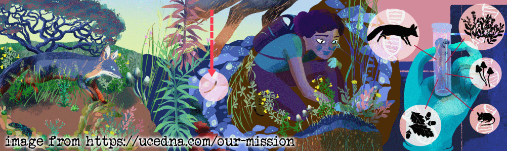

<style type="text/css">
  body{
  font-size: 12pt;
}
</style>

## Learning Outcomes:

1. Students are able to analyse data from an eDNA field sampling 
campaign using appropriate statistical methods;
2. Students are able to interpret and understand statistical outputs from the R 
package `vegan`.<br>We will also learn how to display the output of multivariate ordination methods for eDNA data\.

```{r invisible, include=FALSE}
privateAPI="03b0375e8e7c47d0a03018a9001de439"
pal4lite <- c("black", "purple2", "blue2", "cyan4", "forestgreen", 
              "darkorange", "gold3", "red3", "gray80", "white")
pal4liteTransp <- c("#000000","#912CEEb0","#0000EEb0","#008B8Bb0","#228B22b0",
                    "#CDAD00b0", "#FF8C00b0", "#CD0000b0", "#CCCCCC", "#FFFFFF")
pal4dark <- c("white", "pink1", "orange", "khaki1", "lightgreen", "cadetblue1", 
              "deepskyblue", "plum", "gray80", "black")
```

```{r set up, message=FALSE, warning=FALSE, results='hide'}
library(vegan)          # for multivariate analyses
library(stringr)        # for manipulation of character strings
library(viridis)        # for making colourblind-friendly colour palettes
library(flextable)      # for making formatted tables
  set_flextable_defaults(theme_fun = "theme_zebra", font.size = 10)
library(sf)             # handling spatial data
library(maptiles)       # making tile-raster-based maps
library(prettymapr)     # essential map annotations
library(TeachingDemos)  # used just for the shadowtext() function
```

## Import the data

**Notes**:

1. This code imports the data from a file where the **samples are rows** and the 
  **species are columns**.
2. We convert the column `Site` to a *factor* (categorical information in R).

The following code imports the data from a CSV file and converts the numeric 
`Site` column into a factor (*i.e*. categorical column in **R**). The data file
has species (and sample identifying data) as *columns* and samples as *rows*.

```{r}
eDNA2023 <- read.csv(file = "eDNA2023.csv")
eDNA2023$Site <- as.factor(eDNA2023$Site)
```

**OPTIONAL**: If you have *species* as rows and *samples* as columns, we will 
need to do a bit of wrangling! (This could also be done in Excel but, of course, 
we like **R**)

```{r read and wrangle species as rows data, eval=FALSE}
speciesAsRows <- read.csv(file = "speciesAsRows.csv", row.names = 1)
speciesAsRows <- rbind(str_remove(colnames(speciesAsRows), "X"),
                       speciesAsRows)
row.names(speciesAsRows)[1] <- "SiteID"
speciesAsRows <- as.matrix(speciesAsRows) # convert to matrix for next step
speciesAsRows <- t(speciesAsRows) # t() means transpose
eDNA2023 <- as.data.frame(speciesAsRows)
eDNA2023$Site <- as.factor(eDNA2023$Site)
```

```{r map-sample-locations, fig.height=5, fig.width=7.1, message=FALSE, warning=FALSE, fig.align='center', fig.cap="Map of locations where eDNA samples were taken in March 2023 at Ashfield Flats Reserve. Map generated from OpenStreetMap tiles using the R packages `sf` and `maptiles` with annotations using `prettymapr`.", results='hold'}
git <- "https://raw.githubusercontent.com/Ratey-AtUWA/"
afr_map <- read.csv(file=paste0(git,"spatial/main/afr_map_v3.csv"), 
                      stringsAsFactors = TRUE)
UTM50S <- st_crs(32750)
extent <- st_as_sf(x = data.frame(x = c(399860,400520), y = c(6467920,6468350)),
                   coords = c("x","y"), crs=UTM50S)
aftiles <- get_tiles(extent, provider="OpenStreetMap", crop=TRUE, zoom=17)
par(oma=c(3,3,1,1), mgp=c(1.5,0.2,0), tcl = -0.2, 
    lend = "square", ljoin = "mitre", lheight=0.85)
plot_tiles(aftiles) 
axis(1);axis(2);box(which="plot")
mtext("Easting (UTM Zone 50, m)", 1, 1.6, font=2, cex=1.2)
mtext("Northing (UTM Zone 50, m)", 2, 1.6, font=2, cex=1.2)
with(afr_map, polygon(wetland_E, wetland_N, col="lightblue", lty=1, 
                      border="steelblue", lend="round",lwd=1))
with(afr_map, lines(drain_E, drain_N, col = "#8080FFB0", lwd=3))
with(afr_map, polygon(veg_E, veg_N, border = "#60806040", lwd = 5))
addnortharrow("topleft", border=1, text.col=1)
addscalebar(pos="bottomright",plotepsg=32750, linecol=1, label.col=1, 
            htin=0.15, label.cex=1.2, widthhint = 0.15)

# --==##==--  A D D   D A T A  --==##==--
with(eDNA2023[seq(1,NROW(eDNA2023),4),], points(Easting, Northing, col=10, 
                                        bg="orchid1", pch=21, cex=1.5, lwd=2))
with(eDNA2023[seq(1,NROW(eDNA2023),4),], text(Easting, Northing, labels=Site, 
                  col="purple", pos=4, cex = 1, font=4, offset = 0.3))
```

<p>&nbsp;</p>

```{r species-table, message=FALSE, warning=FALSE, paged.print=FALSE}
altnames <- 
  c("MosqFish", "Goby", "Mullet", "BBream", "BnjoFrog", "GToadlet", "MlrdDuck",
    "SpotDove", "SwampHen", "SpoCrake", "WFHeron", "Lorikeet", "Cattle", "Sheep",
    "Mouse", "Rat", "HydroidB", "HydroidO", "BwnJelly", "MoonJely", "Dog")
names_table <- 
  data.frame(Taxonomic = gsub("."," ",colnames(eDNA2023[,6:26]), fixed = T),
             Common=c("Mosquito Fish","Bridled Goby","Gray Mullet","Black Bream",
                      "Western Banjo Frog", "Gunther's Toadlet", "Mallard Duck",
                      "Spotted Turtle Dove", "Purple Swamphen", "Spotted Crake",
                      "White Faced Heron", "Rainbow Lorikeet", "Cattle", "Sheep",
                      "Mouse", "Rat", "HydroidB", "HydroidO", "Brown Jellyfish",
                      "Moon Jellyfish", "Domestic Dog"),
             Abbreviated=altnames)
flextable(names_table,cwidth = c(3,2,2)) |> italic(j=1,part="body") |>
  set_caption(caption="List of all the species detected using eDNA, their common names, and abbreviated names used in plots in this document (human DNA is not included).")
```

<hr style="height: 2px; background-color: #660F00;" />

We need to make a subset of our imported data which contains just the species
presence/absence information (not sample IDs, sites, reps). We also overwrite
the original column names with abbreviated names for better visualisation later.

```{r generate all species data, results='hold'}
allSpecies <- eDNA2023[,6:26] # not columns 1:5 which are sample IDs etc.
colnames(allSpecies) <- names_table[,3]
```

<hr style="height: 2px; background-color: #660F00;" />

> "[Our work on the structure of DNA] *was fairly fast, but you know, we were lucky. One must remember, it was based on the X-ray work done here in London started off by Morris Wilkins and carried on by [Rosalind Franklin](https://www.nature.com/scitable/topicpage/rosalind-franklin-a-crucial-contribution-6538012/){target="_blank"}, and we wouldn’t have got to the stage of at least having a molecular model, if it hadn't been for their work*."
>
> --- [Francis Crick](https://todayinsci.com/C/Crick_Francis/CrickFrancis-Quotations.htm){target="_blank"}, April 1999

<hr style="height: 2px; background-color: #660F00;" />

## Difference and Similarity measures

We start by assessing how similar or different our samples are – to do this we
need to set up a resemblance matrix. Ideally our 4 replicated samples are more
similar to one another than any other samples – but with field sampling this is
not always the case. To determine similarity we need to use a similarity
measure.

### Similarity Measures:
A similarity measure is conventionally defined to take values between 0 and 100%
(or 0 and 1) with the ends of the range representing the extreme possibilities:

- Similarity = 100% (*or 1*) if two samples are totally similar
- Similarity = 0 if two samples are totally dissimilar

What constitutes total similarity, and particularly total dissimilarity, of two
samples depends on the specific criteria that are adopted. For example most
biologists would feel that similarity should equal zero when two samples have no
species in common, and similarity should equal 100% if two samples have
identical entries. Similarities are calculated between every pair of samples
creating a similarity matrix. There are a number of similarity measures (ways to
calculate similarity) which can be used to create this matrix.

**Bray Curtis** and **Jaccard** are two different similarity measures we can use
 – both are commonly used in ecology and have desirable properties – similarity
is calculated based on the taxa that samples have in common. Similarity takes a
value of 0 if two samples have no species in common and joint absences have no
effect (*i.e*. a taxon jointly absent in two samples does not contribute to its
similarity). The difference between them is that Bray Curtis will use abundance
information (where it is present) in assessing similarity, whereas Jaccard
converts abundances to binary (*i.e*. 0s and 1s, with 1 representing presence
and 0 meaning absence) to assess similarity. In our case it does not matter much
which we use, since we have already converted to binary – so let’s proceed with
Jaccard.

**Ecological Question – If two samples have no taxa present each does this**
**make them more similar to one another?**

To assess similarity in the `vegan` **R** package carry out the following steps.
The output shows the first few rows and columns of the dissimilarity matrix;
each number represents the Jaccard distance between samples based on the
presence or absence of species.

```{r dissim matrix all Jaccard, eval=FALSE}
AF_diss_all <- vegdist(allSpecies, 
                           distance = "jaccard") # default is distance = "bray"

# just look at the top corner of the dissimilarity matrix:
txt0 <- capture.output(print(AF_diss_all, digits=3)); txt0[1:10]; rm(txt0)
```

```{r dist matrix all jaccard output with cat, echo=FALSE}
AF_diss_all <- vegdist(allSpecies, 
                           distance = "jaccard")
txt0 <- capture.output(print(AF_diss_all,digits=3))
for (i in 1:11){ cat(txt0[i],"\n") }
```

# Ordinations

Next we will construct our ordination – a procedure to visualise the similarity
matrix by simplifying (scaling) it into fewer dimensions than our original data.
This reduction of dimensions is useful as the original data will have as many
dimensions as there are species, which is impossible to visualise! There are two
different types of ordination that we will use:<br>
**Multi-Dimensional-Scaling** (nmMDS) and **Principal Coordinates Analysis** 
(PCO). If you have previously used PCA – Principal Component Analysis
– you may be familiar with ordination methods. PCA is useful for
environmental datasets – these are represented by a similarity matrix
derived via use of Euclidean Distance as a measure of similarity. PCA is more
suited to environmental variables because of the type of data – there are
no large blocks of zeros (usually) and it is no longer necessary to select a
similarity measure that ignores joint absences. When looking at ordination plots
in general you should note that sample points that are spatially located
together share common characteristics and sample points that are distantly
located from one another share less characteristics. This holds whether we are
working with environmental variables (pH, EC, moisture content, heavy metals
*etc*.) or species abundances.

The main difference between MDS and PCO relates to the underlying use of the
resemblance matrix.

**MDS** takes the similarity measures calculated by Jaccard or Bray Curtis and
ranks them in order. Thus pairs are samples are ranked according to highest to
lowest similarity and are thus plotted in multidimensional space. Since it uses 
the rank and not the actual values, it's commonly called "non-[para]metric" 
multi-dimensional scaling, or **nmMDS**.

**PCO** takes the actual values of the underlying measure of similarity and
plots pairs of samples in multi-dimensional space. It will then look for the
direction (vector) of greatest variance in the multi-dimensional "cloud" of
points, which becomes the first PCO dimension. Successive dimensions explain the
most possible remaining variance, until all variance is accounted for. So, many
PCO dimensions are possible, but usually only the first 2 or 3 are useful for
visualizing our data.

For both types of ordinations the software attempts to preserve the similarity
of each pair of samples – while this is feasible in multidimensional space, in
order for us to view the ordination we see this in 2 or 3 dimensions – thus the
software attempts to preserve as much as is feasible of the sample pair
similarity as calculated – but in reality we need to consider how much the 2-
dimensional view is a true representation of the data set. In nmMDS we use the
*stress* value to evaluate this, in PCO we can plot multiple axes, *i.e*. axis 1
*vs*. axis 2, axis 2 *vs*. axis 3 and so on. The amount of variance explained in
each PCO dimension is called the *eigenvalue*, and the output will include these
values; the greater the eigenvalue, the more useful a PCO dimension is. In
practice, much of the variability is often explained in the first two axes
(*i.e*. 2 dimensions) and we will limit our analysis to these axes for this
dataset.

## Non-metric multidimensional scaling (nmMDS)

In `vegan` this is done using the `metaMDS()` function. We need to specify an
input matrix of just the species data (*e.g*. `allSpecies` which we made
earlier). The default is to find 2 dimensions (`k`) using a Bray-Curtis
dissimilarity matrix, but we can set these options to different values using 
`k =` and `distance =` options. The dissimilarity matrix is calculated within 
the `metaMDS()` function, so for consistency we set `distance ="jaccard"`.

```{r run nmds all jaccard, results='hide'}
# default with 2 dimensions
AF_nmds_all <- metaMDS(allSpecies, distance = "jaccard")
# 3 dimensions for comparison
AF_nmds_all3 <- metaMDS(allSpecies, k=3, distance = "jaccard")
```

```{r show mds all jaccard}

# show output for 2 nmMDS dimensions
AF_nmds_all
```

The 2D stress value is &asymp; 0.188. This can be interpreted as follows:

```{r nmMDS-stress, fig.height=1.25, fig.width=7.5, fig.align='center', fig.cap="Interpretation of the stress parameter in non-metric multidimensional scaling ordination.", echo=FALSE}
par(mar=c(2,0,1,0))
plot(c(0,0.4),c(0,1),type="n",bty="n",xaxs="i",yaxs="i",xaxt="n",yaxt="n",xlab="",ylab="")
axis(1,at=c(0.05,0.1,0.2,0.3),labels=c(0.05,0.1,0.2,0.3));abline(h=0)
mtext("What's good stress? (for nmMDS)", adj=0.02)
abline(v=c(0.05,0.1,0.2), lty = 2)
text(c(0.025,0.075,0.15,0.3), rep(0.25,5),
     labels=c("excellent","great","good but caution",
              "maybe useful but potentially wrong . . ."),
     col = c("chartreuse4","blue","darkorange2","firebrick3"))
par(mar=c(4,4,1,1))
```

<p>&nbsp;</p>

The stress value in this example is relatively high as we are dealing with a
large number of samples with lots of 1 and 0 values in a 2 dimensional space -–
resulting in a challenging similarity environment.

**&#8680;** Check the stress value of the 3-D ordination – is it lower? 
Remember that we made this object in the code block above:

```{r show mds all jaccard 3dim, eval=FALSE, results='hide'}
AF_nmds_all3
```

The following plot (Figure \@ref(fig:plot-nmds-2D)) mimics the nmmds plot in
Deirdre's handout (note that the sign of dimension MDS2 is reversed).

```{r plot-nmds-2D, fig.height=6, fig.width=6, out.width="70%", fig.align='center', fig.cap="Two-dimensional nmMDS plot, showing ordination of species and samples, for the Ashfied Flats eDNA data including DNA from all species except humans.", results='hold'}
palette(c("black",magma(15,alpha = 0.8),"white"))
par(mar=c(3,3,1,1), mgp=c(1.6,0.3,0), tcl=0.25, font.lab=2)
plot(AF_nmds_all$points, pch=c(rep(21:25, 3),21,22)[eDNA2023$Site], 
     xlim = c(-1.6,2.2), ylim = c(1.2,-1.2),
     bg=c(1:17)[eDNA2023$Site],
     cex = 1.4, main = NA, col.main = "steelblue")
# text(AF_nmds_all$points, labels=eDNA2023$Site, cex=0.9, pos = 4, 
#      col="grey40")
text(AF_nmds_all, display = "species", col = "#20208080", font=3, cex = 0.9)
legend("bottomright", inset = 0.01, box.col = 3, ncol = 4,
       x.intersp=0.75, title = "Site", 
       legend = seq(1,17), pch=c(rep(21:25, 3),21,22), 
       pt.bg = c(1:17), pt.cex = 1.4, cex = 1.1)
```

<p>&nbsp;</p>

We can plot the nmMDS ordination in different ways (*e.g.* 
Figure \@ref(fig:plot-nmds-2D-v2)) -- choose which one you think is easiest to 
interpret, or code your own!

```{r plot-nmds-2D-v2, fig.height=6, fig.width=6, out.width="70%", fig.cap="NMDS ordination plot (alternative plot style) for all species detected using eDNA analysis of water from Ashfield Flats."}
palette(c("#00000080",magma(15,alpha = 0.5),"white"))
par(mar=c(3,3,1,1), mgp=c(1.6,0.3,0), tcl=0.25, font.lab=2)
plot(AF_nmds_all$points, pch=21, 
     xlim = c(-1.6,2.2), ylim = c(1.2,-1.2),
     bg=c(1:17)[eDNA2023$Site],
     cex = 2.6, main=NA, col.main = "steelblue")
palette(c("black",magma(15),"white"))
text(AF_nmds_all$points, labels=eDNA2023$Site, cex=0.9, 
     col=c(seq(17,13,-1),1,1,17,1,1,seq(5,1,-1))[eDNA2023$Site])
TeachingDemos::shadowtext(AF_nmds_all$species, 
                          labels = row.names(AF_nmds_all$species), 
                          col = "#20208080", bg="#FFFFFF80", font=3, cex = 0.8)
```

<p>&nbsp;</p>

You can play around with the code to make additional changes – you won’t
break it by trying, so play around as much as you like. You will notice that
there are only 2 points for Site 2 – this is because the points are overlaid on
top of one another – as we are picking up only a few taxa some of the samples
are very similar to one another. However we can generally see that there are
sample groupings and that likely location has an effect (*i.e*. samples that are
from the same location are closer together). We will test this statistically a
little later.

## Principal Coordinates Analysis

In the `vegan` **R** package we use Weighted classical multidimensional scaling,
also known as *Weighted Principal Coordinates Analysis*. This is implemented
using the function `wcmdscale()`.

```{r}
AF_pco_all <- wcmdscale(vegdist(allSpecies), eig=TRUE)
AF_pco_all
```
```{r basic-pco-plot, fig.height=5, fig.width=5, fig.align='center', fig.cap="Principal coordinates analysis plot of an R object made using the `wcmdscale()` function from the `vegan` package."}
plot(AF_pco_all)
```

<p>&nbsp;</p>

Figure \@ref(fig:basic-pco-plot) is a basic PCO plot based on all species,
showing the locations of individual samples by row number.

We can make more informative plots (Figure \@ref(fig:baseR-pco-plot)) by using
the information stored in the output object (`AF_pco_all`).

```{r baseR-pco-plot, fig.width=8, fig.height=4, out.width="70%", fig.align='center', fig.cap="Alternative principal coordinates analysis plots of an R object made using the `wcmdscale()` function from the `vegan` package: (a) first and second dimensions; (b) first and third dimensions.", results='hold'}
palette(c("black","grey60","grey42",plasma(17),"white"))
par(mfrow = c(1,2), mar = c(4,4,1,1), mgp = c(1.7,0.3,0), tcl = 0.25, 
    font.lab = 2)
plot(AF_pco_all$points[,c(1,2)], xlim = c(0.4,-0.6), ylim = c(0.4,-0.6), 
     pch=1, cex=2.5, col=2)
text(AF_pco_all$points[,c(1,2)],labels = eDNA2023$Site,
     col=seq(1,17)[eDNA2023$Site])
mtext("(a)",line=-1.3, adj=0.03, cex=1.2)
plot(AF_pco_all$points[,c(1,3)], xlim = c(0.4,-0.6), ylim = c(0.4,-0.6), 
     pch=1, cex = 2.5, col = 2)
text(AF_pco_all$points[,c(1,3)],labels = eDNA2023$Site,
     col=seq(1,17)[eDNA2023$Site])
mtext("(b)",line=-1.3, adj=0.03, cex=1.2)
```

<p>&nbsp;</p>

If we want to see the PCO scores for all dimensions, we could run the following 
code. There will be lots of output; as we saw above, there are 68 points and 17
dimensions (axes, *i.e*. new variables).
```
AF_pco_scores <- scores(AF_pco_all)
print(AF_pco_scores, digits=3)
```

<p>&nbsp;</p>



<p>&nbsp;</p>

# PERMANOVA

In order to test where location has a significant effect on the taxa at our
field site we need to run an ANOVA – however as we have multiple species
to test together we cannot run a basic ANOVA – we must run a multivariate
permutational ANOVA or **PERMANOVA**.

PERMANOVA shares some resemblance to ANOVA where they both measure the
sum-of-squares within and between groups, and make use of an F test to compare
within-group to between-group variance. However, while ANOVA bases the
significance of the result on assumption of normality, PERMANOVA draws tests for
significance by comparing the actual F test result to that gained from random
permutations of the objects between the groups. Moreover, whilst PERMANOVA tests
for similarity based on a chosen distance measure, ANOVA tests for similarity of
the group averages.

We could calculate a univariate measure of diversity (a Simpson or Shannon
index, for example) and run an ANOVA on that univariate value. In doing so,
however, we are reducing the complex dataset to a simplified version and losing
discrete information in the process. Remember that ANOVA also has an underlying
assumption of normality – generally speaking, biological species data are
not normally distributed and thus do not satisfy this assumption. This makes
applying a permutational ANOVA a much better option. Before the advent of
computational capacity a permutational ANOVA would have taken quite some time to
run – luckily now it only takes a matter of seconds to minutes depending
on the complexity of the dataset.

In the `vegan` package, the `adonis2()` function implements Permutational 
Multivariate Analysis of Variance Using Distance Matrices (*i.e*. PERMANOVA).

We use a formula in the `adonis2()` function which expresses the community
matrix (*i.e*. the columns of species presence or absence) as a function of a
factor (in this case, `Site`).

```{r}
AF_permanova_all <- adonis2(eDNA2023[,6:26] ~ Site, data = eDNA2023,
                            permutations = 9999)
AF_permanova_all
```

P value by permutation = `1e-04` indicating a significant effect of location on
the community composition of our samples. Note that 9999 permutations were
undertaken to arrive at this value.

The output from the `pairwise.adonis2()` function is quite lengthy (to see it, 
run `print(AF_PWpermanova_all)`). We can tidy it up for clarity with a custom 
function (`plainPW()` – see Table \@ref(tab:pairwise-Permanova) below).

```{r pairwise-Permanova, paged.print=FALSE}
source("https://github.com/Ratey-AtUWA/eDNA/raw/master/FUN_pairwise_adonis2.R")
source("https://github.com/Ratey-AtUWA/eDNA/raw/master/FUN_plain_pairwise.R")
AF_PWpermanova_all <- pairwise.adonis2(eDNA2023[,6:26] ~ Site, data = eDNA2023)
AF_plainPW_all <- plainPW(AF_PWpermanova_all) # see custom function code below
colnames(AF_plainPW_all)[1] <- "Comparison.between.Sites"
flextable(AF_plainPW_all, cwidth = c(2.5,2)) |> 
  align(align="center", part = "all") |>
  font(i = ~ P_value <=0.05, j = ~P_value, font = "Arial Black") |>
  set_caption(caption="Pairwise comparison p-values (p\u22640.05 in bold font) from PERMANOVA analysis of eDNA data from water samples at Ashfield Flats.")
```

**Notes**: 

- the pairwise Adonis2 source code is by Pedro Martinez Arbizu at [github.com/pmartinezarbizu/pairwiseAdonis](https://raw.githubusercontent.com/pmartinezarbizu/pairwiseAdonis/master/pairwiseAdonis/R/pairwise.adonis2.R).
- The code for the `plainPW()` function is as follows:

```{r plainPW function code, eval=FALSE}
# function inputs output object from Pedro Martinez Arbizu's pairwise.adonis2()
# code at https://github.com/pmartinezarbizu/pairwiseAdonis
plainPW <- function(PWobj) {
  UL_PW_perm <- unlist(PWobj) # convert list to long named vector
  names_PW_perm <- names(UL_PW_perm) # extract the names...
  rows_pvals <- grep("F)1",names_PW_perm) # find the rows we need
  justThePW <- # use the row indices to find the rows in the long vector
    data.frame(Comparison = str_remove(names(UL_PW_perm[rows_pvals]),
                                       fixed(".Pr(>F)1")),
               P_value = as.numeric(UL_PW_perm[rows_pvals]))
  return(justThePW) # and the resulting data frame is the output!
}
```

You can also get the `plainPW()` function code at
[github.com/Ratey-AtUWA/.../FUN_plain_pairwise.R](https://github.com/Ratey-AtUWA/eDNA/raw/master/FUN_plain_pairwise.R){target="_blank"}.

<hr style="height: 2px; background-color: #5560A4;" />

# Optional Extras

```{r stressplot, fig.align='center', fig.cap="Stress plot for nmMDS based on Jaccard dissimilarities, based on presence/absence of all species from eDNA analysis of Ashfield Flats water samples."}
stressplot(AF_nmds_all)
```

<p>&nbsp;</p>

This stress plot (Figure \@ref(fig:stressplot)) shows the decrease in ordination
stress with an increase in the number of ordination dimensions,indicating the
fit between ordination distances and observed dissimilarities. Large scatter
around the line suggests that original dissimilarities are not well preserved in
the reduced number of dimensions. You would proceed to steps of plotting your
NMDS if you identify a minimized stress solution.

## Analysis with just the aquatic species

These are: *Gambusia holbrooki, Arenigobius bifrenatus, Mugil cephalus, Acanthopagrus butcheri, Limnodynastes dorsalis, Pseudophryne guentheri, Blackfordia polytentaculata, Obelia bidentata, Phyllorhiza punctata, Aurelia sp.*

```{r subset to just aquatic, paged.print=FALSE, results='hold'}
fish <- allSpecies[,c(1:6,17:20)]
head(fish)
```

### for interest look at the dissimilarity matrix

```{r dissim matrix aquat bray, eval=FALSE}
AF_diss_aquat <- vegdist(fish, 
                           distance = "bray")
txt0 <- capture.output(print(AF_diss_aquat,digits=3));txt0[1:10];rm(txt0)
```

```{r dist matrix aquat bray output with cat, echo=FALSE, message=FALSE, warning=FALSE}
AF_diss_aquat <- vegdist(fish, 
                           distance = "bray")
txt0 <- capture.output(print(AF_diss_aquat,digits=3))
for (i in 1:11){ cat(txt0[i],"\n") }
```

```{r run nmds aquat Bray, results='hide'}
AF_nmds_aquat <- metaMDS(fish, trymax = 500, 
                           distance = "jaccard")
```
```{r show nmds aquat Bray}
AF_nmds_aquat
```
```{r plot-nmds-aquat-Bray, fig.height=5, fig.width=5, out.width="50%", fig.align='center', fig.cap="Ashfield Flats eDNA nmMDS plot based on just the aquatic species and Bray dissimilarities."}
plot(AF_nmds_aquat, type="p",display = "sites", cex = 1.2)
text(AF_nmds_aquat, display = "species", col = "dodgerblue", cex = 0.8)
```

<p>&nbsp;</p>

### alternative to `vegan` plots
```{r baseR-aquat-nmMDS, fig.height=6, fig.width=6, out.width="60%", fig.align='center', fig.cap="Ashfield Flats eDNA nmMDS plot based on just the aquatic species and Bray dissimilarities, plotted using base R functions."}
palette(viridis::plasma(17))
plot(AF_nmds_aquat$points, pch=c(rep(21:25, 3),21,22)[eDNA2023$Site], 
     xlim = c(-1.2,1.8), 
     bg = seq(1,17)[eDNA2023$Site], 
     cex = 1.4, col.main = "steelblue", main = "Just aquatic species")
# text(AF_nmds_aquat$points, pos = rep(c(1,2,4),6)[eDNA2023$Site], 
#      labels=eDNA2023$Site, cex=1, 
#      col=c(1:17)[eDNA2023$Site])
text(AF_nmds_aquat, display = "species", col = "#20208080", font=3, cex = 0.9)
legend("bottomleft", inset = 0.01, box.col = 3, ncol = 6,
       x.intersp=0.75, title = "Site", 
       legend = seq(1,17), pch=c(rep(21:25, 3),21,22), 
       pt.bg = seq(1,17), pt.cex = 1, cex = 0.9)
```

<p>&nbsp;</p>

## Detrended correspondence analysis – all species

```{r}
AF_dca_all <- decorana(allSpecies)
AF_dca_all
```

```{r decorana-plot, fig.height=5, fig.width=5, out.width="50%", fig.align='center', fig.cap="Ashfield Flats eDNA detrended correspondence analysis plot based on all species."}
plot(AF_dca_all)
```

<p>&nbsp;</p>

## For comparison if wanted: nmMDS again with Bray-Curtis distances
```{r run nmds Bray allspecies, results='hide'}
AF_nmds_all_B <- metaMDS(allSpecies) # uses Bray by default
```

```{r show nmds Bray allspecies, results='hold'}
AF_nmds_all_B
```

The results should be identical to nmMDS with Jaccard, since the community
matrix is already converted to presence-absence (binary ones and zeros).

## Additional options for `vegan` ordination plots

We can make a *rough* categorisation of Sites based on their location, for
example as shown in the code below:

```{r make-zones, message=FALSE, warning=FALSE}
eDNA2023$Zone <- 
  c(rep("UChapman",4),rep("UChapman",4),rep("UChapman",4),rep("LChapman",4),rep("LChapman",4), 
    rep("Pond",4),rep("Kitchener",4),rep("Kitchener",4),rep("Woolcock",4),rep("LChapman",4),
    rep("Pond",4),rep("UChapman",4),rep("UChapman",4),rep("LChapman",4),rep("LChapman",4),
    rep("Woolcock",4),rep("Pond",4))
eDNA2023$Zone <- factor(eDNA2023$Zone, 
                levels = c("Pond","Kitchener","LChapman","UChapman","Woolcock"))
```

<span style="font-family: cambria, serif; background-color:cyan;">**Note** that
this is not the only way to divide the Sites into Zones - you may think of a
better and/or clearer categorisation!</span>

We can then use the Zones (or any other category) to display the ordination
results in ways that help us to understand the data. Figure \@ref(fig:nmds-ellipses)
shows some examples.

```{r nmds-ellipses, fig.align='center', fig.height=10, fig.width=12, message=FALSE, warning=FALSE, fig.cap="Ordination plots made using a combination of functions from the `vegan` package and base R, showing (a) 75% CI ellipses around Zone groups; (b) convex hulls around Site groups; (c) 'spiders' around Zone groups. In plots (a) and (c) the `shadowtext()` function from the `teachingDemos::` package is used for clearer labels."}
# plot (a) ellipses
par(mar=c(3,3,1,1), mgp=c(1.7,0.3,0), tcl=0.25, lend=2, ljoin=1, font.lab=2,
    mfrow=c(2,2))
palette(c("black", inferno(8)[2:6],"white"))
plot(AF_nmds_all, display="sites", cex=1.4, xlim=c(-1.8,1.6), ylim=c(-1.8,1.1))
mtext("(a)", side=3, line=-1.6, adj=0.03, cex=1.4)
points(AF_nmds_all$points, col=c(1,3:6)[eDNA2023$Zone], pch=19, cex=1.4)
ordiellipse(AF_nmds_all, groups=eDNA2023$Zone, col=2:6, lwd=2, 
            kind = "sd", conf=0.75)
shadowtext(tapply(AF_nmds_all$points[,1], eDNA2023$Zone, mean),
           tapply(AF_nmds_all$points[,2], eDNA2023$Zone, mean),
           labels=levels(eDNA2023$Zone), cex=1.2, col=2:6, bg=7, r=0.2)
# legend("bottomright", legend=levels(eDNA2023$Zone),col=2:6,lty=1,lwd=2,bty="n", 
#        text.col = 2:6)
# legend("bottomright", bty="n", legend=levels(eDNA2023$Zone), col=1, pt.bg=2:6,
#        lty=1, lwd=2, pch=21, pt.cex=1.5,text.col = 2:6)
legend("bottomright", bty="n", legend=levels(eDNA2023$Zone), title="Zone",
       col=c(1,3:6), pt.bg=2:6, lty=1, lwd=2, pch=NA, pt.cex=1.5, cex=1.2)
legend("bottomright", bty="n", legend=levels(eDNA2023$Zone), col=7, 
       pt.bg=c(1,3:6), lty=NA, lwd=2, pch=21, pt.cex=2.2, cex=1.2)

# plot (b) convex hulls
par(mar=c(3,3,1,1), mgp=c(1.7,0.3,0), tcl=0.25, lend=2, ljoin=1, font.lab=2)
palette(c("black", rocket(19)[2:18],"white"))
plot(AF_nmds_all, display="sites", cex=1.4, xlim=c(-1.8,1.6), ylim=c(-1.8,1.1))
points(AF_nmds_all$points, bg=c(2:18)[eDNA2023$Site], 
       pch=c(rep(21:25,3),21,22)[eDNA2023$Site], cex=1.4)
ordihull(AF_nmds_all, groups=eDNA2023$Site, 
         col="blue3", lwd=2, label=TRUE, font=3)
ordihull(AF_nmds_all, groups=eDNA2023$Site, 
         col=2:18, lwd=2, label=F)
mtext("(b)", side=3, line=-1.6, adj=0.03, cex=1.4)
legend("bottomright", bty="n", legend=levels(eDNA2023$Site), title="Site",
        ncol=6, col=2:18, pt.bg=2:18, lty=1, lwd=2, pch=NA, pt.cex=1.5)
legend("bottomright", bty="n", legend=levels(eDNA2023$Site), ncol=6, col=1, 
     pt.bg=2:18, lty=NA, lwd=2, pch=c(rep(21:25,3),21,22), pt.cex=1.5, pt.lwd=1)

# (c) spiders
palette(c("black", plasma(8)[2:6],"white"))
plot(AF_nmds_all, display="sites", cex=1.4, xlim=c(-1.8,1.6), ylim=c(-1.8,1.1))
mtext("(c)", side=3, line=-1.6, adj=0.03, cex=1.4)
points(AF_nmds_all$points, col=c(1,3:6)[eDNA2023$Zone], pch=19, cex=1.4)
ordispider(AF_nmds_all, groups=eDNA2023$Zone, col=c(1,3:6), lwd=1)
shadowtext(tapply(AF_nmds_all$points[,1], eDNA2023$Zone, mean),
           tapply(AF_nmds_all$points[,2], eDNA2023$Zone, mean),
           labels=levels(eDNA2023$Zone), cex=1.2, col=2:6, bg=7, r=0.2)
# legend("bottomright", legend=levels(eDNA2023$Zone),col=2:6,lty=1,lwd=2,bty="n", 
#        text.col = 2:6)
# legend("bottomright", bty="n", legend=levels(eDNA2023$Zone), col=1, pt.bg=2:6,
#        lty=1, lwd=2, pch=21, pt.cex=1.5,text.col = 2:6)
legend("bottomright", bty="n", legend=levels(eDNA2023$Zone), title="Zone",
       col=c(1,3:6), pt.bg=2:6, lty=1, lwd=2, pch=NA, pt.cex=1.5, cex=1.2)
legend("bottomright", bty="n", legend=levels(eDNA2023$Zone), col=7, 
       pt.bg=c(1,3:6), lty=NA, lwd=2, pch=21, pt.cex=2.2, cex=1.2)
```

## References and **R** Packages

Dunnington, Dewey (2017). *prettymapr: Scale Bar, North Arrow, and Pretty Margins in *R. 
R package version 0.2.2. [CRAN.R-project.org/package=prettymapr](https://CRAN.R-project.org/package=prettymapr){target="_blank"}.

Giraud T (2021). maptiles: Download and Display Map Tiles. R package version 0.3.0, [CRAN.R-project.org/package=maptiles](https://CRAN.R-project.org/package=maptiles){target="_blank"}.

Garnier S, Ross N, Rudis R, Camargo AP, Sciaini M, Scherer C (2021). *Rvision - Colorblind-Friendly Color Maps for R* (**viridis**). R package version 0.6.2. [sjmgarnier.github.io/viridis/](https://sjmgarnier.github.io/viridis/){target="_blank"}

Gohel D, Skintzos P (2022). _flextable: Functions for Tabular Reporting_. 
R package version 0.8.1, [CRAN.R-project.org/package=flextable](https://CRAN.R-project.org/package=flextable){target="_blank"}.

Oksanen J, Simpson G, Blanchet F, Kindt R, Legendre P, Minchin P, O'Hara R,
Solymos P, Stevens M, Szoecs E, Wagner H, Barbour M, Bedward M, Bolker B,
Borcard D, Carvalho G, Chirico M, De Caceres M, Durand S, Evangelista H,
FitzJohn R, Friendly M, Furneaux B, Hannigan G, Hill M, Lahti L, McGlinn D,
Ouellette M, Ribeiro Cunha E, Smith T, Stier A, Ter Braak C, Weedon J (2022).
_vegan: Community Ecology Package_. R package version 2.6-2,
[CRAN.R-project.org/package=vegan](https://CRAN.R-project.org/package=vegan){target="_blank"}.

Pebesma, E., 2018. Simple Features for R: Standardized Support for Spatial 
VectorData. *The R Journal* **10** (1), 439-446, 
[doi:10.32614/RJ-2018-009](https://doi.org/10.32614/RJ-2018-009){target="_blank"}. (package **sf**)

Wickham H (2022). _stringr: Simple, Consistent Wrappers for Common String Operations_. R package version 1.4.1, [CRAN.R-project.org/package=stringr](https://CRAN.R-project.org/package=stringr){target="_blank"}.
  
<hr style="height: 2px; background-color: #5560A4;" />

<span style="font-size:9pt">Created with `rmarkdown` in RStudio.</span>
